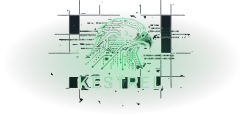

<div align="center" style="background:#000; padding: 32px 0;">
  
</div>

<p align="center">
  <strong>Context engineering for humans in an agentic multitasking world.</strong><br>
  <sub>A GNOME Shell extension that gives each project its own workspace — agent, browser, files — in a scrollable strip you supervise at a glance.</sub>
</p>

<p align="center">
  <a href="https://notiriel.github.io/kestrel/">Project Site</a> &middot;
  <a href="#install">Install</a> &middot;
  <a href="#keybindings">Keybindings</a> &middot;
  <a href="#claude-code-integration">Claude Code</a> &middot;
  <a href="#development">Development</a>
</p>

---

## The Problem

Agentic tasks keep getting longer. You're no longer writing code — you're supervising multiple AI agents working across multiple projects in parallel. The idle time between interactions grows, so you context-switch constantly. But your OS was designed for a world where you do one thing at a time. Alt-Tab through five terminals? You lose track. Scatter them across virtual desktops? You miss a permission request. Everything stalls silently.

## What Kestrel Does

Kestrel gives each project its own workspace — agent terminal, browser, reference files — arranged in a horizontal strip you scroll through. Status badges show which agents are working, waiting, or done. Permission requests surface inline. Workspaces stack vertically for context separation. You see everything, switch effortlessly, and miss nothing.

```
            ← scroll →

        ┌────────┬────────┬────────┬────────┐
   W0   │  agent │  agent │  agent │  agent │
        ├────────┼────────┼────────┼────────┤
   W1   │  docs  │ browser│        │        │
        ├────────┼────────┼────────┼────────┤
   W2   │  slack │  notes │  term  │        │
        └────────┴────────┴────────┴────────┘

        ▓▓▓▓▓▓▓▓▓▓▓▓▓▓▓▓▓
        └── your view ───┘
```

## Features

- **Scrolling tiling** — windows in horizontal strips, half or full monitor width
- **Agent status badges** — see which Claude Code sessions are working, waiting, or done
- **Permission overlays** — approve or deny tool requests without switching windows
- **Virtual workspaces** — stacked vertically, created and removed dynamically
- **Bird's-eye overview** — see all workspaces at once, navigate with keyboard or click
- **Multi-monitor** — monitors combine into a single panoramic viewport
- **State persistence** — layout survives screen lock and extension restarts
- **Keyboard-first** — every action has a binding, everything is rebindable

## Requirements

- GNOME Shell 45+ (Wayland or X11)
- Node.js 18+ and npm (for building)
- [Claude Code](https://docs.anthropic.com/en/docs/claude-code) (optional, for agent integration features)

## Install

```bash
git clone https://github.com/notiriel/kestrel.git
cd kestrel
npm install
make install    # Build + deploy to GNOME extensions dir
make enable     # Enable extension + Claude Code plugin + disable conflicting extensions
```

Then **restart your session** (log out and back in on Wayland, or Alt+F2 → `r` → Enter on X11).

Check installation status:

```bash
make status
```

### What happens during install

`make install` compiles TypeScript, copies the extension to `~/.local/share/gnome-shell/extensions/`, compiles GSettings schemas, and symlinks the Claude Code plugin and Ulauncher extension.

`make enable` enables the GNOME extension, disables conflicting extensions (Ubuntu tiling-assistant, DING, Ubuntu Dock), and enables the Claude Code plugin in `~/.claude/settings.json`.

## Keybindings

All keybindings are configurable via GSettings.

| Keybinding | Action |
|---|---|
| `Super+Right` | Focus next window |
| `Super+Left` | Focus previous window |
| `Super+Down` | Switch to workspace below |
| `Super+Up` | Switch to workspace above |
| `Super+F` | Toggle window half/full width |
| `Super+Shift+Right` | Move window right |
| `Super+Shift+Left` | Move window left |
| `Super+Shift+Down` | Move window to workspace below |
| `Super+Shift+Up` | Move window to workspace above |
| `Super+-` | Toggle overview |
| `Super+N` | Open new window of focused app |
| `Super+.` | Toggle notification focus mode |

Kestrel takes over the Super key and several default GNOME keybindings. `make disable` restores all original bindings.

## Claude Code Integration

Kestrel includes a Claude Code plugin that connects your AI sessions to the desktop via DBus:

- **Session tracking** — each Claude Code terminal is mapped to its window automatically
- **Status badges** — window clones show live session status (working / needs-input / done)
- **Permission cards** — tool permission requests appear as overlay cards you can approve or deny inline
- **Notifications** — fire-and-forget status updates from Claude Code sessions

The integration activates automatically when Claude Code is installed and the plugin is enabled.

## Development

```bash
make build          # Compile TypeScript
make test           # Run all Vitest tests
make dev            # Build + install + enable (then restart session)
npx vitest run test/domain/world.test.ts  # Single test file
```

View extension logs:

```bash
journalctl /usr/bin/gnome-shell --since "5 minutes ago" --no-pager
```

### Architecture

Hexagonal architecture with a pure domain core and GNOME Shell adapters:

```
Reality → Domain → Adapter → Reality
(events)  (world)  (clones)  (screen)
```

- **`src/domain/`** — Pure TypeScript, no GNOME imports, fully testable with Vitest
- **`src/ports/`** — Adapter interfaces (no platform dependencies)
- **`src/adapters/`** — GNOME Shell integration via `gi://` imports

The domain is the source of truth. Adapters never compute layout or focus — they translate between GNOME signals and domain calls, then apply the domain's output.

See [`docs/design.md`](docs/design.md) for the product spec and [`docs/solution-design.md`](docs/solution-design.md) for technical architecture.

## Uninstall

```bash
make disable    # Restore GNOME keybindings, disable extension and plugin
rm -rf ~/.local/share/gnome-shell/extensions/kestrel@kestrel.github.com
```

## License

[MIT](LICENSE)
