# Architecture

Visual guide to Kestrel's internals. For product design see [design.md](design.md), for technical decisions see [solution-design.md](solution-design.md).

---

## 1. Layer Overview

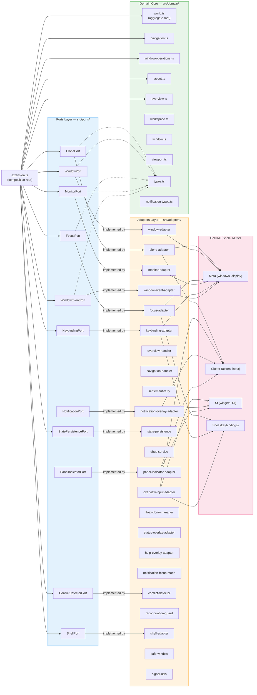

**Import rule:** Domain and Ports never import `gi://` modules. All GNOME interaction flows through Adapters.

---

## 2. Module Dependency Map

### Domain internals

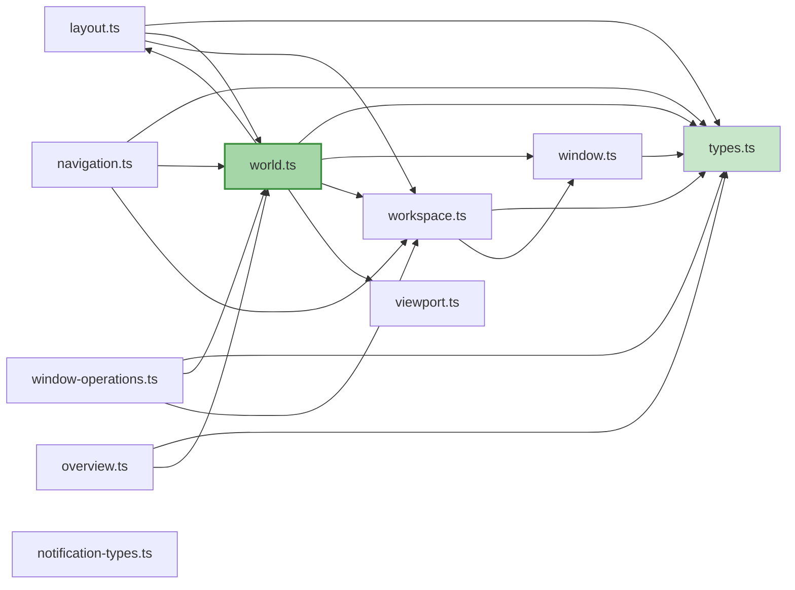

`world.ts` is the aggregate root — all state mutations go through it. `navigation.ts`, `window-operations.ts`, and `overview.ts` are operation modules that take a `World` and return a `WorldUpdate`.

### Extension wiring

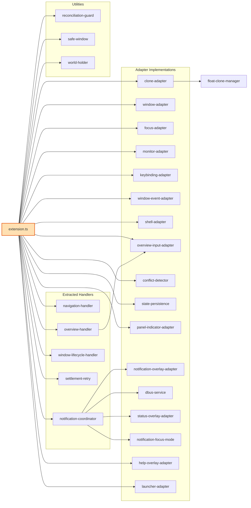

---

## 3. Port–Adapter Matrix

| Port | Adapter | Responsibility |
|------|---------|----------------|
| `ClonePort` | `clone-adapter` | Clone lifecycle, workspace strip, focus indicator, overview zoom |
| `WindowPort` | `window-adapter` | `move_resize_frame()` on real `Meta.Window`s |
| `FocusPort` | `focus-adapter` | `Meta.Window.activate()`, external focus tracking |
| `MonitorPort` | `monitor-adapter` | Read monitor geometry, `monitors-changed` signal |
| `ShellPort` | `shell-adapter` | Shell method wrappers (`Main.*`) |
| `KeybindingPort` | `keybinding-adapter` | Register/unregister `Meta.KeyBindingAction`s |
| `WindowEventPort` | `window-event-adapter` | `window-created`, `first-frame`, `destroy` signals |
| `StatePersistencePort` | `state-persistence` | Save/restore `World` across enable/disable cycles |
| `NotificationPort` | `notification-overlay-adapter` | Claude Code notification cards in overview |
| `PanelIndicatorPort` | `panel-indicator-adapter` | Workspace name in GNOME top bar |
| `ConflictDetectorPort` | `conflict-detector` | Detect keybinding conflicts with other extensions |

---

## 4. State Machines

### Window lifecycle

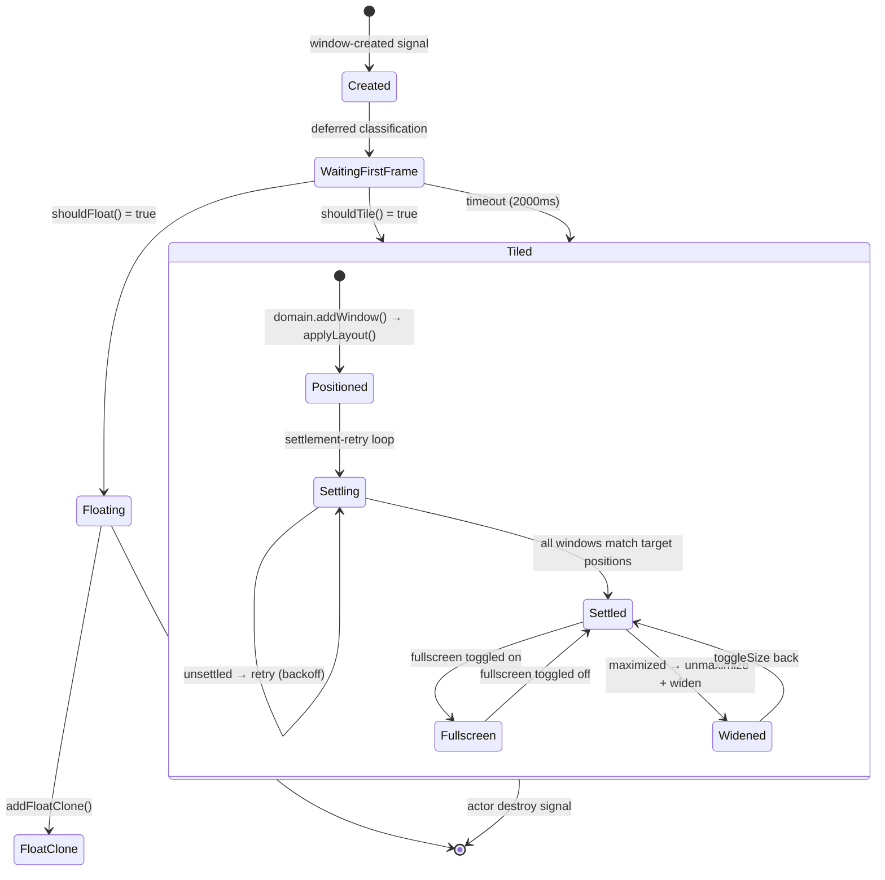

### Overview mode

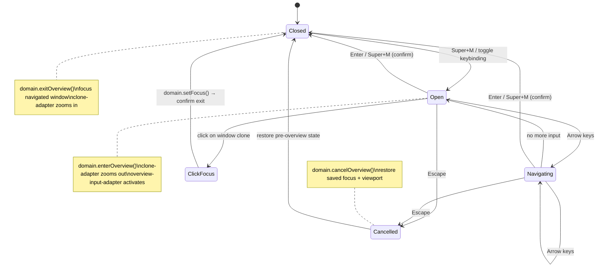

### Settlement retry

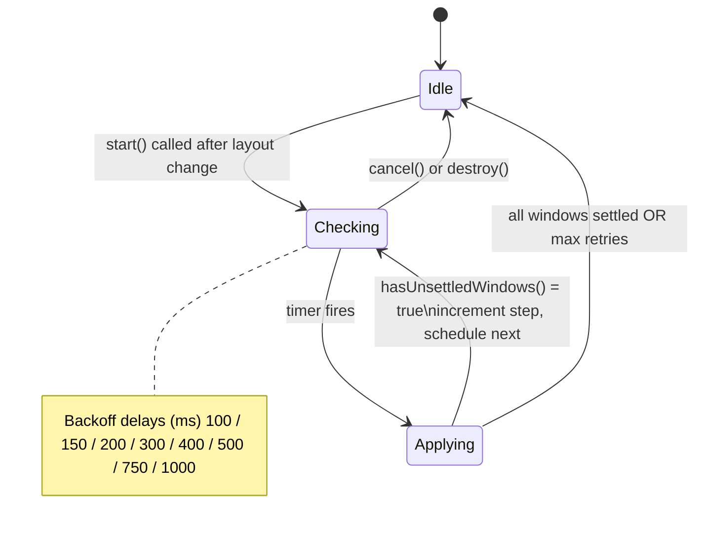

### Viewport scroll

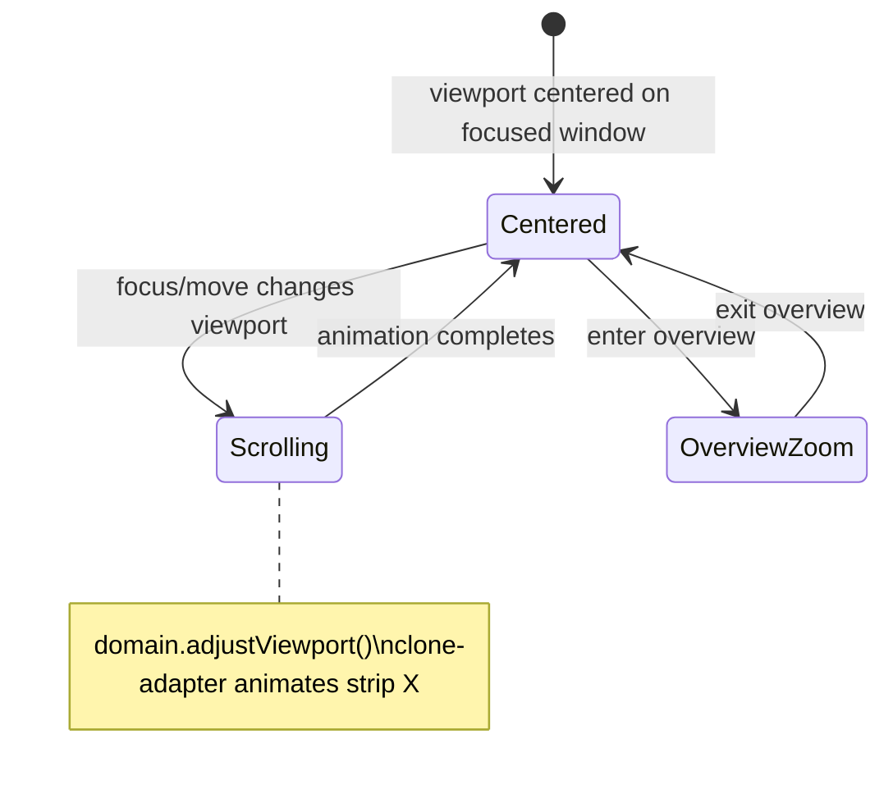

---

## 5. Signal Choreography

### Window creation flow

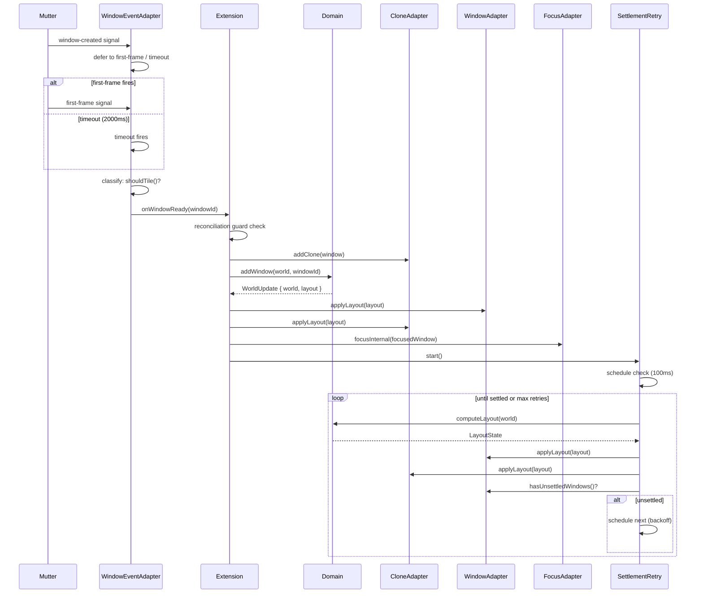

### Keybinding → layout flow

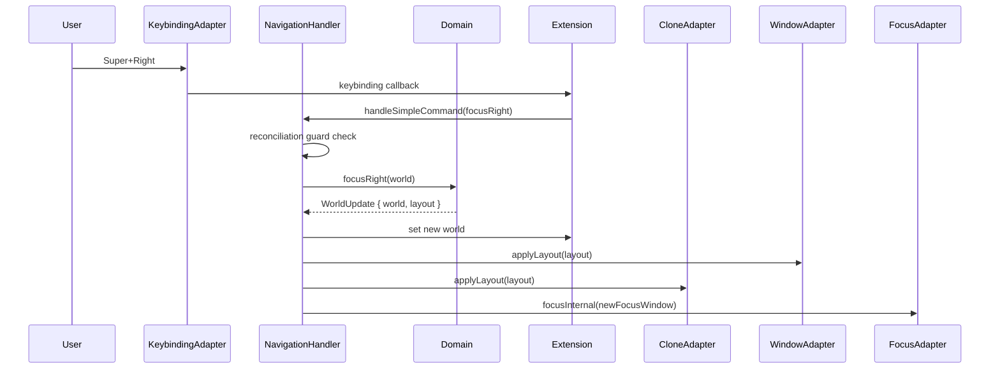

### Vertical move (cross-workspace)

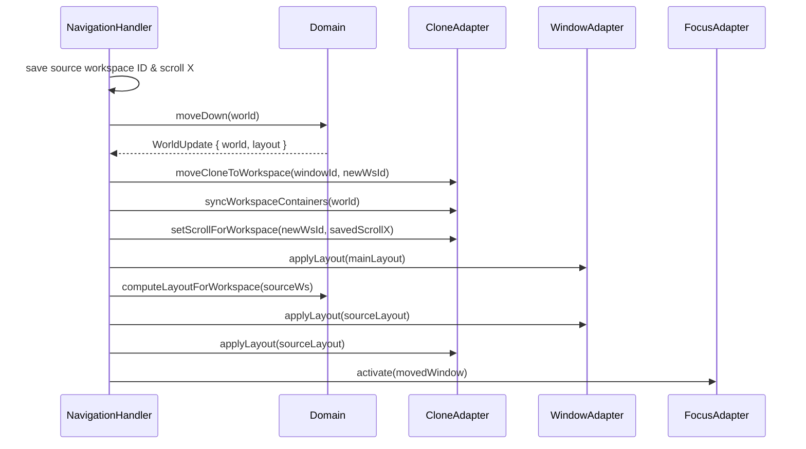

### Overview enter/exit

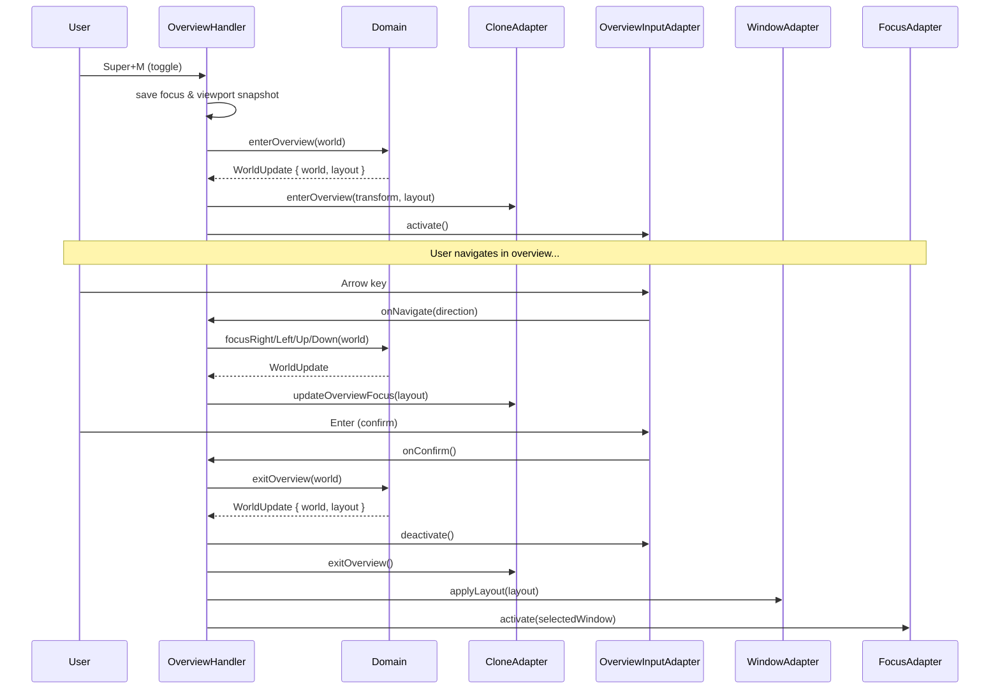

### Window destruction flow

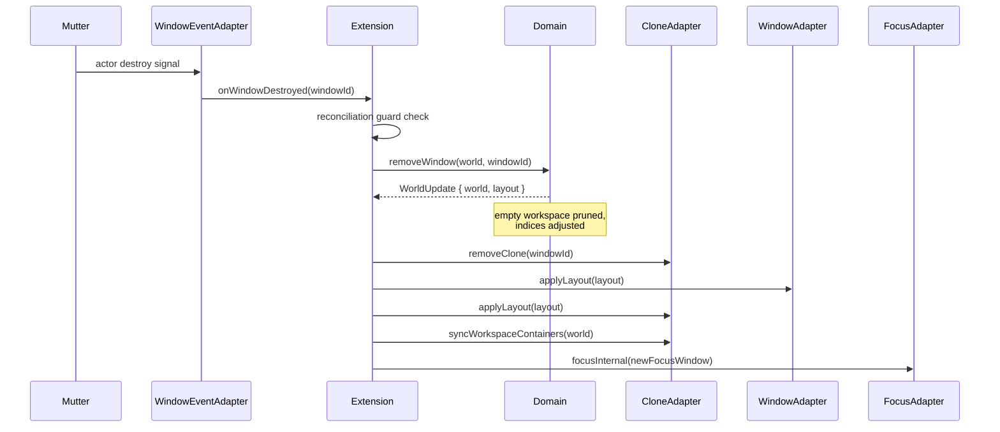

---

## 6. Feature Walkthrough

### Adding a new keybinding

**Example:** Add `Super+G` to group windows.

1. **Schema** — `schemas/org.gnome.shell.extensions.kestrel.gschema.xml`
   - Add a new key: `<key name="group-windows" type="as"><default>['&lt;Super&gt;g']</default></key>`

2. **Domain** — `src/domain/window-operations.ts` (or new file)
   - Write a pure function: `groupWindows(world: World): WorldUpdate`
   - Add tests in `test/domain/`

3. **Port** — `src/ports/keybinding-port.ts`
   - Add the binding name to `KeybindingCallbacks` interface

4. **Adapter** — `src/adapters/keybinding-adapter.ts`
   - Register the binding in `enable()`, unregister in `destroy()`

5. **Extension** — `src/extension.ts`
   - Wire the callback: call domain function → `_applyLayout()` → `focusInternal()`

6. **Build & test**
   ```bash
   npx vitest run test/domain/window-operations.test.ts
   make install
   ```

### Adding a new adapter

**Example:** Add a sound-effects adapter.

1. **Port** — `src/ports/sound-port.ts`
   - Define interface: `interface SoundPort { playNavigate(): void; playOverview(): void; }`

2. **Adapter** — `src/adapters/sound-adapter.ts`
   - Implement `SoundPort` using `gi://` audio APIs
   - Include `destroy()` for cleanup

3. **Extension** — `src/extension.ts`
   - Import and instantiate in `enable()`
   - Call port methods at appropriate points (after navigation, overview enter/exit)
   - Call `destroy()` in `disable()`

---

## 7. Glossary

| Term | Meaning |
|------|---------|
| **World** | Complete domain state: all workspaces, windows, focus, viewport, config |
| **WorldUpdate** | Return type of domain operations: `{ world, layout }` — new state + computed positions |
| **Workspace** | Virtual container of windows (Kestrel concept, not GNOME workspaces) |
| **Slot** | Half-monitor-width unit. A window occupies 1 or 2 slots. |
| **Viewport** | 2D camera showing a portion of the workspace. Width = monitor. Scrolls in 1-slot increments. |
| **Clone** | `Clutter.Clone` of a `Meta.WindowActor`, positioned on a custom layer for scrolling |
| **Clone wrapper** | `Clutter.Actor` parent of a clone, sized to layout target, clips overflow |
| **Settlement** | State where all real windows match their target positions (Wayland configures complete) |
| **Settlement retry** | Exponential-backoff loop re-applying layout until windows settle |
| **Reconciliation guard** | Debounce mechanism preventing duplicate signal processing within a frame |
| **Overview transform** | Scale + offset that zooms out the workspace strip to show all workspaces |
| **Float clone** | Clone of a non-tiled window (dialog, popup) rendered above the tiling layer |
| **Layout** | `LayoutState` — computed pixel positions for all windows in a workspace |
| **Branded type** | TypeScript type with a phantom brand field (`WindowId`, `WorkspaceId`) for type safety |
