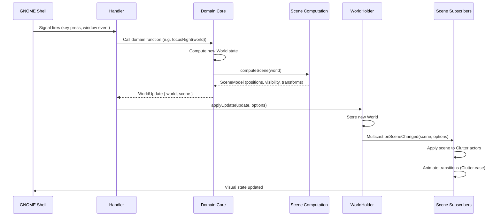
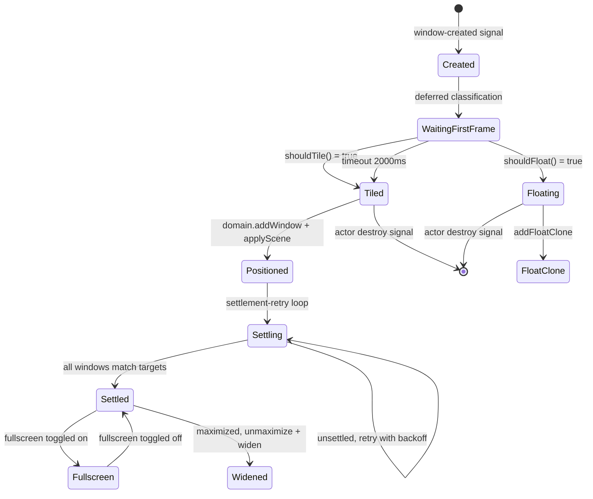
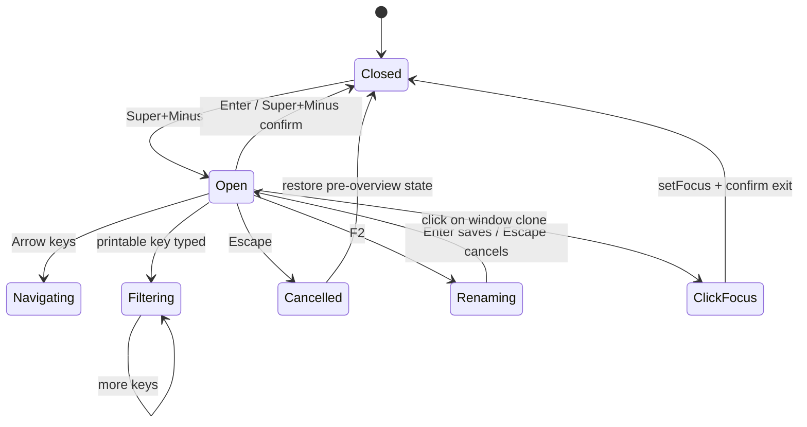
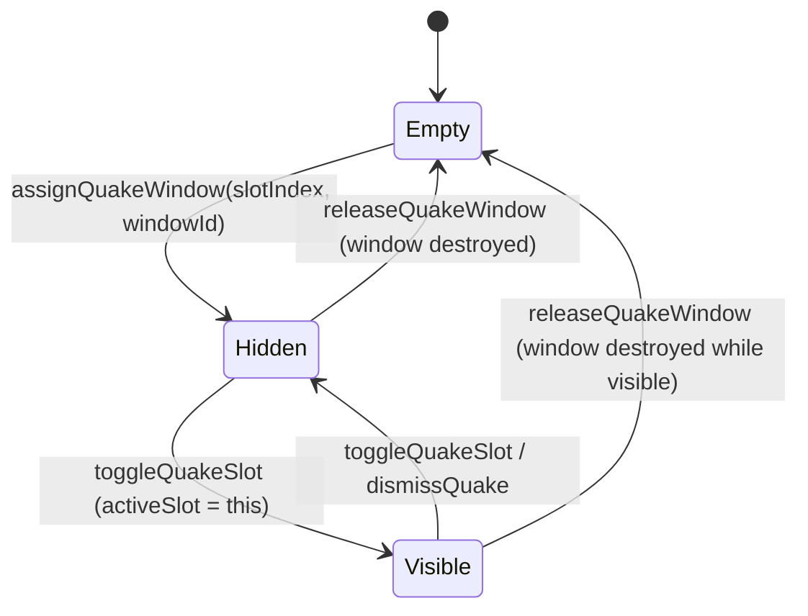
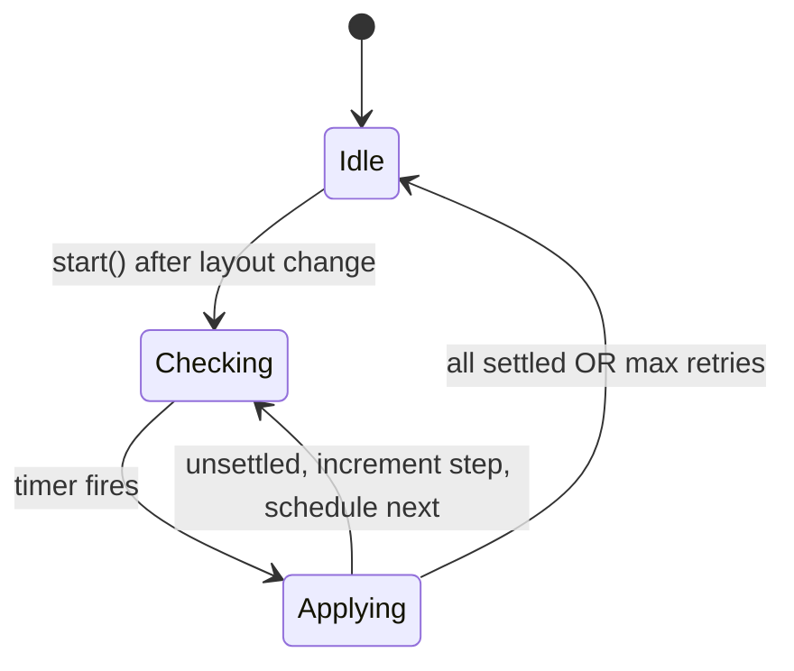
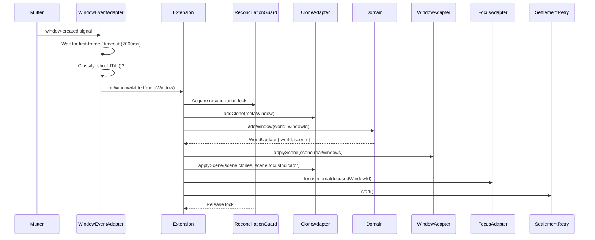
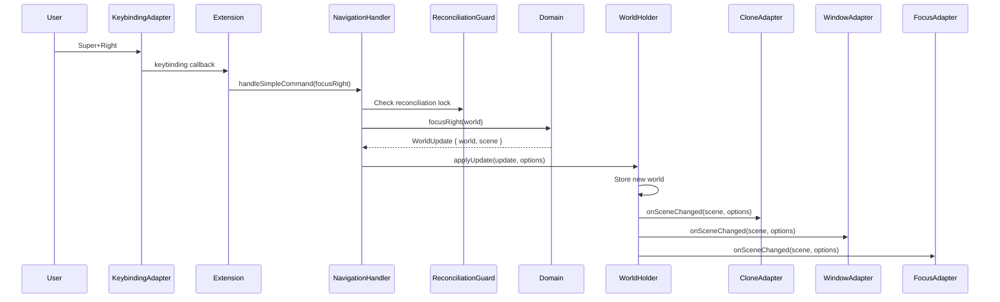
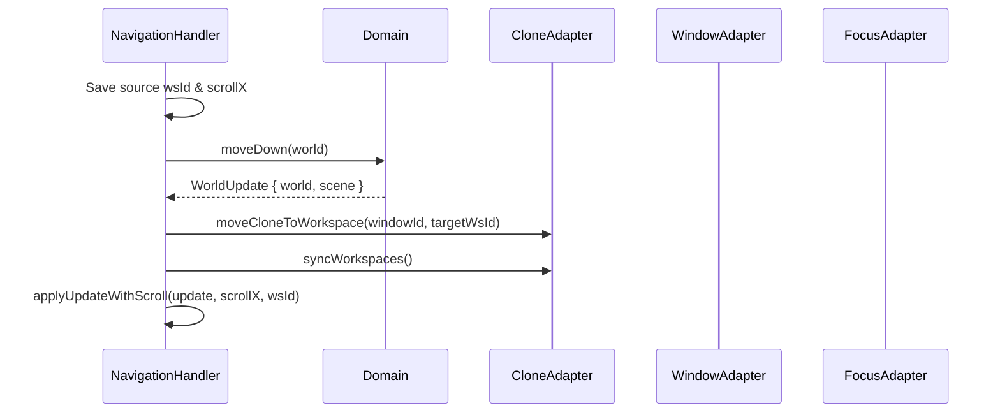
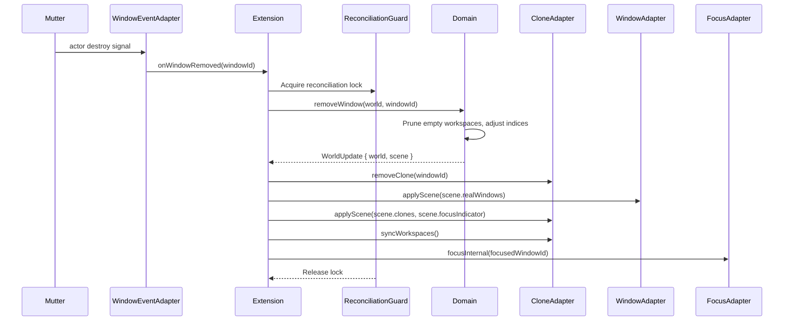

# Kestrel Technical Architecture

Kestrel is a GNOME Shell extension that facilitates context engineering for humans in an agentic multitasking world — giving each project and its context (agent terminal, browser, files) a separate workspace in a scrollable strip, making task-switching effortless and keeping an overview easy.

This document describes how the codebase is structured and why. It is the primary technical reference for contributors and maintainers.

## 1. Layer Overview

Kestrel follows a hexagonal (ports-and-adapters) architecture with four layers:

```mermaid
graph TB
    subgraph "Domain Core (src/domain/)"
        direction LR
        world["world.ts\nAggregate root"]
        scene["scene.ts\nSceneModel computation"]
        layout["layout.ts\nPixel positions"]
        nav["navigation.ts\nFocus movement"]
        winops["window-operations.ts\nWindow move/resize"]
        ws["workspace.ts\nWorkspace operations"]
        vp["viewport.ts\nCamera state"]
        win["window.ts\nTiledWindow"]
        types["types.ts\nBranded types, interfaces"]
        overview["overview.ts\nOverview mode"]
        overviewState["overview-state.ts\nOverview interaction"]
        notif["notification.ts\nNotification lifecycle"]
        notifTypes["notification-types.ts\nNotification types"]
        fuzzy["fuzzy-match.ts\nFuzzy search"]
        quake["quake.ts\nQuake console"]
    end

    subgraph "Ports (src/ports/)"
        direction LR
        clonePort["ClonePort"]
        windowPort["WindowPort"]
        focusPort["FocusPort"]
        monitorPort["MonitorPort"]
        keybindingPort["KeybindingPort"]
        shellPort["ShellPort"]
        windowEventPort["WindowEventPort"]
        statePersistencePort["StatePersistencePort"]
        conflictDetectorPort["ConflictDetectorPort"]
        notificationPort["NotificationPort"]
        panelIndicatorPort["PanelIndicatorPort"]
    end

    subgraph "Adapters (src/adapters/)"
        direction LR
        subgraph "input/"
            monitorAdapter["monitor-adapter.ts"]
            keybindingAdapter["keybinding-adapter.ts"]
            windowEventAdapter["window-event-adapter.ts"]
            conflictDetector["conflict-detector.ts"]
            overviewInput["overview-input-adapter.ts"]
            mouseInput["mouse-input-adapter.ts"]
        end
        subgraph "output/"
            cloneAdapter["clone-adapter.ts"]
            windowAdapter["window-adapter.ts"]
            focusAdapter["focus-adapter.ts"]
            notifOverlay["notification-overlay-adapter.ts"]
            panelIndicator["panel-indicator-adapter.ts"]
            quakeAdapter["quake-window-adapter.ts"]
            statusOverlay["status-overlay-adapter.ts"]
            floatClone["float-clone-manager.ts"]
        end
        shellAdapter["shell-adapter.ts"]
        statePersistence["state-persistence.ts"]
        notifCoordinator["notification-coordinator.ts"]
        handlers["Handlers:\nnavigation-handler.ts\noverview-handler.ts\nwindow-lifecycle-handler.ts"]
    end

    subgraph "UI Components (src/ui-components/)"
        direction LR
        cards["notification-card.ts\npermission-card.ts\nquestion-card.ts"]
        builders["card-builders.ts\nclone-ui-builders.ts\nstatus-badge-builders.ts\npanel-indicator-builders.ts"]
        uiHelpers["help-overlay.ts\nhelp-builders.ts\nfocus-mode-builders.ts\nanimation-helpers.ts"]
    end

    world --> types
    scene --> types
    layout --> types
    nav --> world
    winops --> world

    cloneAdapter --> clonePort
    windowAdapter --> windowPort
    focusAdapter --> focusPort
    monitorAdapter --> monitorPort
    keybindingAdapter --> keybindingPort
    shellAdapter --> shellPort
    windowEventAdapter --> windowEventPort
    statePersistence --> statePersistencePort
    conflictDetector --> conflictDetectorPort
    notifOverlay --> notificationPort

    handlers --> world
    handlers --> cloneAdapter
    handlers --> windowAdapter
    handlers --> focusAdapter

    notifOverlay --> cards
    cloneAdapter --> builders
```



### Domain Core (src/domain/)

Pure TypeScript with no `gi://` imports. Fully testable with Vitest.

| File | Purpose |
|------|---------|
| `types.ts` | Branded types (`WindowId`, `WorkspaceId`), core interfaces (`World`, `WorldUpdate`, `KestrelConfig` (includes `columnCount`), `MonitorInfo`) |
| `world.ts` | Aggregate root. Functions: `createWorld`, `addWindow`, `removeWindow`, `setFocus`, `buildUpdate`, `updateMonitor`, `updateConfig`, `enterFullscreen`, `exitFullscreen`, `widenWindow`, `switchToWorkspace`, `filterWorkspaces`, `restoreWorld`, `adjustViewport`, `ensureTrailingEmpty`, `pruneEmptyWorkspaces`, `renameCurrentWorkspace` |
| `scene.ts` | `computeScene(world)` pure function producing `SceneModel` from `World`. Iterates columns and computes per-window positions including stacked window y/height within columns. Also `diffScene()` for diagnostics. Types: `CloneScene`, `RealWindowScene`, `FocusIndicatorScene`, `WorkspaceContainerScene`, `WorkspaceStripScene` |
| `layout.ts` | `computeWindowPositions()`, `computeFocusedWindowPosition()` — iterates columns and computes pixel positions, splitting height equally for stacked windows within a column (internal to scene computation and viewport adjustment) |
| `navigation.ts` | `focusRight`, `focusLeft`, `focusDown`, `focusUp`, `forceWorkspaceUp`, `forceWorkspaceDown` — pure functions taking `World`, returning `WorldUpdate`. Vertical focus is overloaded: navigates within stack first, then switches workspace. No `overviewActive` guards — keybinding action mode (`Shell.ActionMode.NORMAL`) prevents navigation during overview |
| `window-operations.ts` | `moveRight`, `moveLeft`, `moveDown`, `moveUp`, `toggleSize`, `toggleStack` |
| `workspace.ts` | `Workspace` type and `Column` type. Column operations: `addColumn`, `removeWindowFromColumn`, `columnNeighbor`, `swapColumns`, `slotIndexOf`, `columnAtSlot`, `insertColumnAt`, `replaceWindowInColumn`, `columnOf`, `positionInColumn`, `stackWindowLeft`, `unstackWindow`, `reorderInColumn` |
| `window.ts` | `TiledWindow` interface and `createTiledWindow` factory (fullscreen state) |
| `viewport.ts` | `Viewport` type: `createViewport`, tracks current workspace index, scrollX, widthPx |
| `overview.ts` | `enterOverview`, `exitOverview`, `cancelOverview` |
| `overview-state.ts` | `OverviewInteractionState` (filter text, rename state, saved focus/viewport), `OverviewTransform`, filter/rename/navigation functions, `computeOverviewTransform`, `overviewHitTest` |
| `notification.ts` | Full notification lifecycle (`addNotification`, `respondToNotification`, `dismissForSession`, etc.), question interaction (`navigateQuestion`, `selectQuestionOption`, `setOtherText`), focus mode, session/window tracking, response formatting |
| `notification-types.ts` | `OverlayNotification`, `QuestionOption`, `QuestionDefinition`, `ClaudeStatus` |
| `fuzzy-match.ts` | Fuzzy search for overview workspace filter |
| `quake.ts` | Quake console lifecycle: `assignQuakeWindow`, `toggleQuakeSlot`, `dismissQuake`, `releaseQuakeWindow`, `isQuakeWindow` |
| `todo.ts` | Workspace TODO list: `TodoItem`, `TodoOverlayState`, `toggleTodoOverlay`, `dismissTodoOverlay`, `navigateUp/Down`, `todoToggleComplete`, `startNewItem`, `startEditItem`, `confirmEdit`, `cancelEdit`, `requestDelete`, `confirmDelete`, `cancelDelete`, `pruneCompleted`, `visibleItems`, `computeTodoGeometry`, `todosFilePath` |

### Ports (src/ports/)

Interface definitions only. No `gi://` imports. The extension depends on ports, never on concrete adapters.

| File | Purpose |
|------|---------|
| `clone-port.ts` | `CloneLifecyclePort`, `CloneRenderPort`, `OverviewRenderPort`, `OverviewFilterPort` (and composite `ClonePort`) |
| `window-port.ts` | `WindowPort` — position real windows, check settlement |
| `focus-port.ts` | `FocusPort` — focus activation, feedback loop suppression |
| `monitor-port.ts` | `MonitorPort` — monitor geometry reading |
| `keybinding-port.ts` | `KeybindingPort`, `KeybindingCallbacks` — register/unregister keybindings |
| `shell-port.ts` | `ShellPort` — GNOME Shell interaction (hide overview, intercept animations) |
| `window-event-port.ts` | `WindowEventPort`, `WindowEventCallbacks` — window lifecycle signals |
| `state-persistence-port.ts` | `StatePersistencePort` — save/load world state across enable/disable cycles |
| `conflict-detector-port.ts` | `ConflictDetectorPort` — detect conflicting GNOME extensions |
| `notification-port.ts` | `NotificationPort` — render permission/notification/question cards |
| `panel-indicator-port.ts` | `PanelIndicatorPort` — workspace indicator in top panel |

### Adapters (src/adapters/)

GNOME Shell integration via `gi://` imports. Each adapter implements its corresponding port.

**Input adapters (`src/adapters/input/`)** — detect reality events and call the domain:

| File | Purpose |
|------|---------|
| `keybinding-adapter.ts` | Registers GNOME keybindings from schema. Implements `KeybindingPort` |
| `mouse-input-adapter.ts` | Mouse scroll events for horizontal/vertical navigation |
| `overview-input-adapter.ts` | Keyboard input handler for overview mode |
| `window-event-adapter.ts` | `window-created`/`destroy`/`first-frame` signals, separates float windows. Implements `WindowEventPort` |
| `monitor-adapter.ts` | Reads monitor geometry, `monitors-changed` signal. Implements `MonitorPort` |
| `conflict-detector.ts` | Detects/disables conflicting GNOME extensions. Implements `ConflictDetectorPort` |

**Output adapters (`src/adapters/output/`)** — called by domain (via WorldHolder) to render state:

| File | Purpose |
|------|---------|
| `clone-adapter.ts` | `Clutter.Clone` lifecycle, workspace strip, focus indicator, overview zoom. Implements `CloneLifecyclePort`, `CloneRenderPort`, `OverviewRenderPort`, `OverviewFilterPort` |
| `window-adapter.ts` | Positions real `Meta.Window`s via `move_resize_frame()`, tracks settlement. Implements `WindowPort` |
| `focus-adapter.ts` | `Meta.Window.activate()`, external focus tracking, new/close window suppression. Implements `FocusPort` |
| `quake-window-adapter.ts` | Positions and animates quake overlay windows via `move_resize_frame()` and `Clutter.ease()`, launches apps via `Shell.AppSystem`, matches windows to app IDs via `Shell.WindowTracker` |
| `panel-indicator-adapter.ts` | Workspace indicator in GNOME top panel with click-to-switch. Implements `PanelIndicatorPort` |
| `notification-overlay-adapter.ts` | Renders permission/notification/question card UI. Implements `NotificationPort` |
| `status-overlay-adapter.ts` | Status badge on clone (`working`, `needs-input`, `done`, `end`) |
| `float-clone-manager.ts` | Floating (non-tiled) window clone management |
| `todo-overlay-adapter.ts` | Workspace TODO overlay: modal lifecycle, keyboard dispatch, file I/O (`~/.kestrel/<uuid>/todos.json`), completion timers |

**Handlers** (orchestrate domain calls + adapter updates, stay at `src/adapters/` root):

| File | Purpose |
|------|---------|
| `navigation-handler.ts` | `handleSimpleCommand` (linear focus/move), `handleVerticalFocus` (workspace switch with scroll transfer), `handleVerticalMove` (cross-workspace window move). All delegate to `WorldHolder.applyUpdate()` which multicasts to scene subscribers |
| `overview-handler.ts` | Overview enter/exit/navigate/filter/click/drag/rename. Routes updates through `WorldHolder.applyUpdate()` — scene subscribers detect overview state and route to `updateOverviewFocus` instead of normal layout |
| `window-lifecycle-handler.ts` | Window add/remove/fullscreen/maximize — domain updates + adapter sync |

**Notification system:**

| File | Purpose |
|------|---------|
| `notification-coordinator.ts` | Orchestrates status/permission/notification overlays, DBus, focus mode, Claude session watching |
| `notification-focus-mode.ts` | Keyboard-driven navigation for permission/question cards |
| `dbus-service.ts` | Exports `io.kestrel.Extension` DBus interface |

**Root-level adapters and utilities (`src/adapters/`):**

| File | Purpose |
|------|---------|
| `shell-adapter.ts` | GNOME Shell integration: hides overview, intercepts window animations. Implements `ShellPort` |
| `state-persistence.ts` | Saves/restores world state to dconf settings. Implements `StatePersistencePort` |
| `world-holder.ts` | Observer hub: holds `World` state, multicasts `WorldUpdate` to `SceneSubscriber`s (clone, window, focus, quake) and `WorldSubscriber`s (panel indicator). Handlers call `applyUpdate()` instead of directly invoking adapters |
| `settlement-retry.ts` | Exponential-backoff layout retry for async window configures (primarily Wayland). Delays: `[100, 150, 200, 300, 400, 500, 750, 1000]` ms |
| `reconciliation-guard.ts` | Prevents concurrent/overlapping operations |
| `safe-window.ts` | Safe extraction of window information |
| `signal-utils.ts` | GObject signal management helpers |

### UI Components (src/ui-components/)

Presentational widget builders. These are pure UI construction functions with strict constraints:

- May import `gi://` (St, Clutter, GObject)
- Must NOT import domain types or adapter state
- Complexity limit: 8, LOC limit: 60

| File | Purpose |
|------|---------|
| `help-overlay.ts` | Keybindings help sheet (Super+') |
| `notification-card.ts` | Notification card widget |
| `permission-card.ts` | Permission card widget |
| `question-card.ts` | Question card widget |
| `card-builders.ts` | Shared card construction helpers |
| `card-behavior.ts` | Card hover/focus/animation behavior |
| `clone-ui-builders.ts` | Clone visual construction |
| `status-badge-builders.ts` | Status badge construction |
| `panel-indicator-builders.ts` | Panel indicator construction |
| `notification-overlay-builders.ts` | Notification overlay construction |
| `help-builders.ts` | Help overlay construction |
| `focus-mode-builders.ts` | Focus mode UI construction |
| `animation-helpers.ts` | Clutter animation utilities |
| `todo-overlay-builders.ts` | TODO overlay widget builders: backdrop, card, task rows, edit entry, hint bar |
| `notification-adapter-types.ts` | Notification adapter type definitions |

## 2. Core Data Flow

The fundamental data flow is unidirectional:

```
Reality -(signals)-> Adapters -(domain calls)-> Domain -(WorldUpdate)-> Adapters -(animate)-> Reality
```

All domain operations return `WorldUpdate { world, scene }`. The domain computes the complete desired physical state as a `SceneModel`. Handlers pass updates to `WorldHolder.applyUpdate()`, which multicasts to registered `SceneSubscriber`s (clone layout, window positioning, focus activation, quake) and `WorldSubscriber`s (panel indicator). Subscribers apply the scene by setting actor properties and animating transitions.

**The domain is always the source of truth.** Adapters never compute layout, focus, or workspace state — they only translate between GNOME signals and domain calls, then apply the domain's output. Scene subscribers registered in `extension.ts` handle overview-aware routing: during overview mode, clone updates are routed to `updateOverviewFocus` while window and focus subscribers are suppressed.

Operations like workspace pruning happen immediately in the domain. If a workspace empties, the domain removes it and adjusts all indices in the same operation. The adapter must reconcile its visual state (e.g., clone containers) to match.



## 3. Key Data Types

```typescript
interface World {
    readonly workspaces: readonly Workspace[];
    readonly viewport: Viewport;
    readonly focusedWindow: WindowId | null;
    readonly config: KestrelConfig;
    readonly monitor: MonitorInfo;
    readonly overviewActive: boolean;
    readonly overviewInteractionState: OverviewInteractionState;
    readonly notificationState: NotificationState;
    readonly quakeState: QuakeState;
}

interface WorldUpdate {
    readonly world: World;
    readonly scene: SceneModel;
}

interface SceneModel {
    readonly focusedWindowId: WindowId | null;
    readonly clones: readonly CloneScene[];
    readonly realWindows: readonly RealWindowScene[];
    readonly focusIndicator: FocusIndicatorScene;
    readonly workspaceStrip: WorkspaceStripScene;
    readonly quakeWindow: QuakeWindowScene | null;
}

interface Viewport {
    readonly workspaceIndex: number;
    readonly scrollX: number;
    readonly widthPx: number;
}

interface TiledWindow {
    readonly id: WindowId;
    readonly fullscreen: boolean;
}

interface Column {
    readonly windows: readonly TiledWindow[];
    readonly slotSpan: number;  // horizontal width in slots (1 to columnCount)
}

type WorkspaceColorId = 'blue' | 'purple' | 'rose' | 'amber' | 'teal' | 'coral' | null;

interface Workspace {
    readonly id: WorkspaceId;
    readonly columns: readonly Column[];
    readonly name: string | null;
    readonly color: WorkspaceColorId;  // per-workspace accent color, null = use global config
}
```

```typescript
interface QuakeState {
    readonly slots: readonly (WindowId | null)[];   // 5 slots, null = empty
    readonly activeSlot: number | null;             // which slot is visible, null = all hidden
}

interface QuakeWindowScene {
    readonly windowId: WindowId;
    readonly x: number;
    readonly y: number;
    readonly width: number;
    readonly height: number;
    readonly visible: boolean;      // true when activeSlot matches this slot
}
```

`WindowId` and `WorkspaceId` are branded types — plain numbers at runtime but distinct types at compile time, preventing accidental mixing.

## 4. Port-Adapter Matrix

| Port Interface | Implementing Adapter | Key Responsibilities |
|----------------|---------------------|---------------------|
| `CloneLifecyclePort` | `output/clone-adapter.ts` | Clone creation/destruction, workspace containers |
| `CloneRenderPort` | `output/clone-adapter.ts` | Clone positioning, scroll offsets, focus indicator |
| `OverviewRenderPort` | `output/clone-adapter.ts` | Overview zoom transform, workspace labels |
| `OverviewFilterPort` | `output/clone-adapter.ts` | Filter/sort clones during overview |
| `WindowPort` | `output/window-adapter.ts` | Real window positioning via `move_resize_frame()` |
| `FocusPort` | `output/focus-adapter.ts` | Window activation, focus suppression |
| `MonitorPort` | `input/monitor-adapter.ts` | Monitor geometry, layout change signals |
| `KeybindingPort` | `input/keybinding-adapter.ts` | GNOME keybinding registration |
| `ShellPort` | `shell-adapter.ts` | Overview hiding, animation interception |
| `WindowEventPort` | `input/window-event-adapter.ts` | Window lifecycle signals (create/destroy) |
| `StatePersistencePort` | `state-persistence.ts` | World state save/restore to dconf |
| `ConflictDetectorPort` | `input/conflict-detector.ts` | Conflicting extension detection |
| `NotificationPort` | `output/notification-overlay-adapter.ts` | Permission/notification/question card rendering |
| `PanelIndicatorPort` | `output/panel-indicator-adapter.ts` | Top panel workspace indicator |

## 5. Extension Entry Point

`src/extension.ts` is the composition root. `KestrelExtension extends Extension` (the GNOME Shell base class) and wires together domain and adapters in `enable()`/`disable()`.

### enable() sequence (19 steps)

1. **Conflict detection** — disables conflicting extensions
2. **Config loading** from GSettings
3. **Monitor geometry** reading
4. **World creation** — `createWorld(config, monitor)`
5. **Clone adapter init** — creates Clutter layer hierarchy
6. **Window/focus adapter init**
7. **Panel indicator** with workspace click-to-switch
8. **Notification coordinator** — status overlays, permission cards, DBus service
9. **Overview handler**
10. **Settlement retry** — exponential backoff
11. **Navigation handler**
12. **Mouse input adapter**
13. **Keybinding adapter** — registers all Super+key handlers
14. **External focus tracking**
15. **Monitor change tracking**
16. **Window lifecycle signals** — window-created, destroy
17. **Shell animation interception**
18. **State restoration** from dconf
19. **Settings change listener** for live config reload

### disable()

Reverse order: save state, disconnect signals, destroy adapters, clear debug global.

### Debug mode

When the `debug-mode` setting is true, `enable()` exposes `global._kestrel` with:

- `debugState()` — returns domain world + layout
- `diagnostics()` — runs `computeScene()` and compares expected scene against actual Clutter actor state

## 6. Key Architectural Decisions

### Single GNOME Workspace

All windows live on one GNOME workspace. Kestrel workspaces are virtual, managed entirely in the domain. This avoids conflicts with GNOME's built-in workspace switching animations and transition effects.

### Clone-Based Rendering

`Meta.WindowActor`s cannot be reparented from `global.window_group`. `Clutter.Clone` allows free positioning on a custom Clutter layer for horizontal scrolling, overview zoom, and workspace strip rendering. This approach works on both Wayland and X11.

The layer hierarchy:

```
global.stage
  +-- global.window_group (real WindowActors, opacity 0)
  +-- kestrel-layer (above window_group, clipped to monitor)
        +-- overview-bg
        +-- kestrel-strip (translated Y for workspace switch)
        |     +-- kestrel-ws-{id} (per workspace container)
        |           +-- kestrel-scroll-{id} (translated X for scrolling)
        |                 +-- kestrel-clone-{windowId} (wrapper, clips content)
        |                       +-- Clutter.Clone { source: WindowActor }
        +-- kestrel-focus-indicator
```

Real windows are hidden (opacity 0) and positioned at their target coordinates. Clones mirror the window content and are freely positioned on the custom layer. This separation allows scrolling clones without moving actual windows.

### Scene Model

`computeScene()` is a pure function that produces a complete `SceneModel` describing the exact physical state of every visual element — clone positions, real window positions, focus indicator geometry, and workspace strip transform.

Adapters consume the scene model rather than computing positions themselves. This keeps all coordinate math testable in the domain and ensures the adapter layer is a thin translation from scene model to Clutter actor properties.

### Target-State Model

Domain operations compute only final positions, not transitions. Adapters handle animation via `Clutter.ease()` independently. When rapid input arrives (e.g., holding Super+Right), each new `WorldUpdate` retargets the animation from the current interpolated position to the new target, producing smooth continuous motion.

### Focused-Window Alignment

Mutter's `constrain_partially_onscreen` prevents real windows from being positioned entirely outside the monitor workarea (on both Wayland and X11). The solution is to ensure `scrollX` always positions the focused window within monitor bounds. Non-focused windows may end up at incorrect real positions, but this is acceptable — the first click on a misaligned window focuses it (via passive GNOME click-to-focus), which adjusts scrollX to align it. The second click then lands correctly.

## 7. State Machines

### Window Lifecycle



### Overview Mode



### Quake Slot



Animation states (SLIDING_IN / SLIDING_OUT) are purely adapter concerns — the domain only tracks HIDDEN vs VISIBLE via `activeSlot`. The adapter manages transition animations when applying scene changes.

### Settlement Retry



Backoff delays: `[100, 150, 200, 300, 400, 500, 750, 1000]` ms. Each step checks whether all real windows match their target positions. If any window is unsettled, the layout is re-applied and the next retry is scheduled with increasing delay.

## 8. Signal Choreography

### Window Creation



### Keybinding to Layout



### Vertical Move (Cross-Workspace)



### Window Destruction



## 9. Textual Model Notation

Tests and bug reports use a compact notation for describing world state:

```
<>  viewport (what's visible on screen)
[]  focus indicator (which window has focus)
/   stacked windows in the same column (e.g. A/B means A above B)
```

Example — two workspaces, B focused on WS1:

```
A
<[B] C>
D E
```

Reading: WS0 has window A. WS1 (current viewport) has windows B and C. The viewport shows B and C, with B focused. WS2 has windows D and E.

Example with stacking — B and C stacked in one column on WS1:

```
A
<[B/C] D>
E
```

Reading: WS0 has A. WS1 (current viewport) has a column containing B and C (B focused, above C), and D in its own column. WS2 has E.

Each line is a workspace. Windows are separated by spaces. `<>` marks the viewport boundaries. `[]` marks the focused window. `/` separates stacked windows within a column. A window name alone (like `A`) means it is offscreen.

## 10. Glossary

| Term | Meaning |
|------|---------|
| World | Complete domain state: all workspaces, windows, focus, viewport, config, overview, notifications |
| WorldUpdate | Return type of domain operations: `{ world, scene }` — new state + scene model |
| SceneModel | Domain-computed physical state: positions for every clone, real window, focus indicator, workspace strip |
| Workspace | Virtual container of columns (Kestrel concept, not GNOME workspaces) |
| Column | Vertical group of one or more stacked windows sharing the same horizontal slot(s). Has `slotSpan` and `windows[]` |
| Slot | `monitorWidth / columnCount` unit. A column occupies 1 to `columnCount` slots |
| Viewport | 2D camera showing a portion of the workspace. Width = monitor pixels. Scrolls to fit focused window |
| Clone | `Clutter.Clone` of a `Meta.WindowActor`, positioned on custom layer for scrolling |
| Clone wrapper | `Clutter.Actor` parent of a clone, sized to layout target, clips overflow |
| Settlement | State where all real windows match their target positions (async configures complete, primarily Wayland) |
| Settlement retry | Exponential-backoff loop re-applying layout until windows settle |
| Reconciliation guard | Prevents concurrent/overlapping signal-driven operations |
| Overview transform | Scale + offset that zooms out workspace strip to show all workspaces |
| Float clone | Clone of a non-tiled window (dialog, popup) rendered above the tiling layer |
| Branded type | TypeScript type with phantom brand field (`WindowId`, `WorkspaceId`) for type safety |
