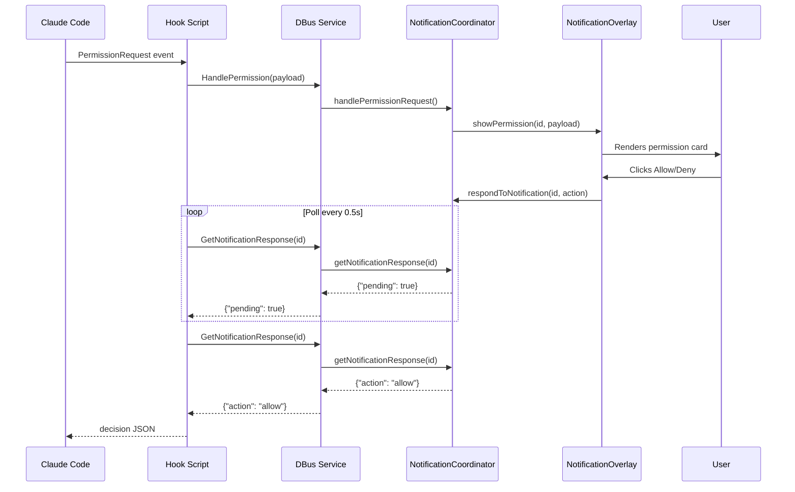

# Claude Code Plugin

## Overview

The Kestrel Claude Code plugin (`kestrel-plugin/`) integrates Claude Code sessions with the Kestrel window manager via shell hooks that communicate with the extension over session DBus.

Features:

- **Status badges** on window clones showing Claude session state (working, needs-input, done)
- **Permission cards** rendered as overlay UI for approving/denying tool use
- **Question cards** for answering AskUserQuestion prompts visually
- **Notification cards** for fire-and-forget session notifications
- **Workspace operations** via DBus (list, switch-by-name, rename)

## DBus Interface

**Interface:** `io.kestrel.Extension`
**Object path:** `/io/kestrel/Extension`
**Bus:** GNOME Shell session bus
**Destination:** `org.gnome.Shell` (the extension does NOT own a well-known bus name)

Example call:

```bash
gdbus call --session --dest org.gnome.Shell \
  --object-path /io/kestrel/Extension \
  --method io.kestrel.Extension.HandleNotification '"{\"type\":\"notification\",\"title\":\"Done\"}"'
```

### Methods

| Method | Args | Returns | Purpose |
|--------|------|---------|---------|
| `HandlePermission` | `payload: s` (JSON) | `{"id":"notif-N"}` | Show permission card, return ID for polling |
| `HandleNotification` | `payload: s` (JSON) | `{"id":"notif-N"}` | Fire-and-forget notification card |
| `GetNotificationResponse` | `id: s` | `{"action":"allow"}` or `{"pending":true}` | Poll user's response to a permission card |
| `SetWindowStatus` | `sessionId: s, status: s, message: s` | -- | Update clone status badge with optional message |
| `ListWorkspaces` | -- | JSON array | List non-empty workspaces with metadata |
| `SwitchToWorkspaceByName` | `name: s` | `{"ok":true}` | Navigate to workspace by name |
| `RenameCurrentWorkspace` | `name: s` | `{"ok":true}` | Rename current workspace |
| `GetDiagnostics` | -- | `{"expected":...,"actual":...,"mismatches":...}` | Compare expected vs actual scene state |

### HandlePermission Payload Format

```json
{
  "session_id": "abc-123",
  "type": "permission",
  "title": "Tool Use: Bash",
  "message": "ls -la",
  "tool_name": "Bash",
  "command": "ls -la"
}
```

For questions (AskUserQuestion), the payload includes the full `tool_input` with questions array.

### GetNotificationResponse Return Values

| Response | Meaning |
|----------|---------|
| `{"action":"allow"}` | User approved |
| `{"action":"deny"}` | User denied |
| `{"action":"always"}` | User approved permanently |
| `{"action":"ask"}` | User chose to fall back to terminal UI |
| `{"action":"allow","answers":{...}}` | Question answered with selections |
| `{"pending":true}` | No response yet |

### ListWorkspaces Response

```json
[
  {"index": 0, "name": "Frontend", "windowCount": 3, "isCurrent": true, "claudeStatus": "working"},
  {"index": 1, "name": "Backend", "windowCount": 2, "isCurrent": false, "claudeStatus": null}
]
```

## Hook Scripts

Located in `kestrel-plugin/hooks/`. Each script is triggered by Claude Code events defined in `hooks.json`.

### kestrel-probe.sh (SessionStart)

Maps Claude Code session IDs to GNOME windows via terminal title escape sequences.

Process:

1. Reads `session_id` from JSON stdin
2. Walks process chain to find controlling terminal's pts device
3. Sends escape sequence `\033]0;kestrel_probe_<SESSION_ID>\033\\` to set window title
4. Extension detects the title, maps session to window
5. Title resets to "Claude" after 0.3s

### kestrel-status.sh (SessionStart, Notification, UserPromptSubmit, PreToolUse, PostToolUse, Stop, SessionEnd)

Updates the clone status badge via DBus.

```bash
# Called with status as $1
kestrel-status.sh working      # Claude processing
kestrel-status.sh needs-input  # Awaiting user input
kestrel-status.sh done         # Session idle/ready
kestrel-status.sh end          # Session ended
```

Calls `SetWindowStatus(sessionId, status, "")` on DBus. Empty message preserves existing message.

### kestrel-notify.sh (Stop)

Sends fire-and-forget notification cards when a session completes.

Builds JSON payload with session_id, type=notification, title, message. Calls `HandleNotification` on DBus.

### kestrel-permission.sh (PermissionRequest)

Routes permission requests to the Kestrel overlay for visual approval.

Process:

1. Filters: skips AskUserQuestion tool (handled by kestrel-question.sh), falls through if screen is locked
2. Builds payload with permission details (title, tool_name, command)
3. Calls `HandlePermission` -- receives notification ID
4. Polls `GetNotificationResponse` every 0.5s (up to 10 minutes)
5. Outputs decision JSON back to Claude Code:
   - `allow` -- `{"hookSpecificOutput":{...,"decision":{"behavior":"allow"}}}`
   - `deny` -- deny decision with message
   - `always` -- allow + applies first permission suggestion
   - `ask` -- falls through to terminal UI
   - Timeout -- defaults to `ask`

If Kestrel is unavailable (DBus fails), defaults to allow.

### kestrel-question.sh (PreToolUse with AskUserQuestion)

Routes AskUserQuestion tool calls to the Kestrel overlay for keyboard-driven answering.

Process:

1. Falls through if screen is locked
2. Builds payload with type=permission, title="Question", full tool_input
3. Calls `HandlePermission` -- receives notification ID
4. Polls `GetNotificationResponse` every 0.5s (up to 10 minutes)
5. If answered: returns answers keyed by question text as `updatedInput`
6. If dismissed/timeout: outputs nothing (tool runs in terminal UI)

## Hook Event Mapping

From `hooks.json`:

| Event | Hooks Triggered |
|-------|-----------------|
| `SessionStart` | probe, status(done) |
| `Notification` | status(needs-input) |
| `UserPromptSubmit` | status(working) |
| `PreToolUse` | question (AskUserQuestion only), status(working) |
| `PostToolUse` | status(working) |
| `PermissionRequest` | permission |
| `Stop` | status(done), notify |
| `UserPromptSubmit` | summary (async) |
| `Stop` | summary (async) |
| `SessionEnd` | status(end) |

### kestrel-summary.sh (UserPromptSubmit, Stop — async)

Generates a 2-4 word summary of the user prompt or agent completion and sends it as a status message.

Process:

1. Checks `KESTREL_SUMMARIZING` env var to prevent recursion
2. Extracts `prompt` (UserPromptSubmit) or `last_assistant_message` (Stop) from JSON stdin
3. Calls `claude -p --model haiku` to summarize in 2-4 words
4. Sends summary via `SetWindowStatus(sessionId, status, summary)` on DBus

Runs as `async: true` so it doesn't block Claude Code. The summary appears ~1-3s after the status badge color changes.

## Data Flow



## Session Probing

The probe mechanism maps Claude Code sessions to GNOME windows:

```
Claude Code starts session
  -> kestrel-probe.sh runs
  -> Sends terminal title escape: \033]0;kestrel_probe_<SESSION_ID>\033\\
  -> GNOME Shell updates window title
  -> Extension detects title change via window signals
  -> Maps session_id -> WindowId in domain notification state
  -> Title reset to "Claude" after 300ms
```

This mapping enables:

- Status badges on the correct clone
- Notification dismissal when window is destroyed
- Workspace-aware notification routing

## Status Badges

Visual indicators on window clones showing Claude session state:

| Status | Visual | Trigger |
|--------|--------|---------|
| `working` | Spinner/progress indicator | UserPromptSubmit, PreToolUse, PostToolUse |
| `needs-input` | Attention indicator | Notification event |
| `done` | Checkmark/idle indicator | Stop event, SessionStart |
| `end` | Session ended indicator | SessionEnd event |

## Specialized Agents

The plugin includes two specialized agents in `kestrel-plugin/agents/`:

- **dbus-manual-tester.md** -- Manual QA agent for testing the live extension. Executes test cases against the running instance, inspects domain state via `global._kestrel`, reports structured pass/fail results.

- **paperwm-expert.md** -- Source code analyst for the PaperWM extension (at `~/development/PaperWM`). Answers questions about PaperWM architecture, signal handling, and window management.

## Plugin Installation

The plugin is installed automatically by `make install`:

1. Symlinks `kestrel-plugin/` to `~/.claude/plugins/kestrel`
2. Copies hook scripts to `~/.claude/plugins/cache/kestrel-local/kestrel/1.0.0/hooks/`

`make enable` adds the plugin to `~/.claude/settings.json`.
`make disable` removes it.
