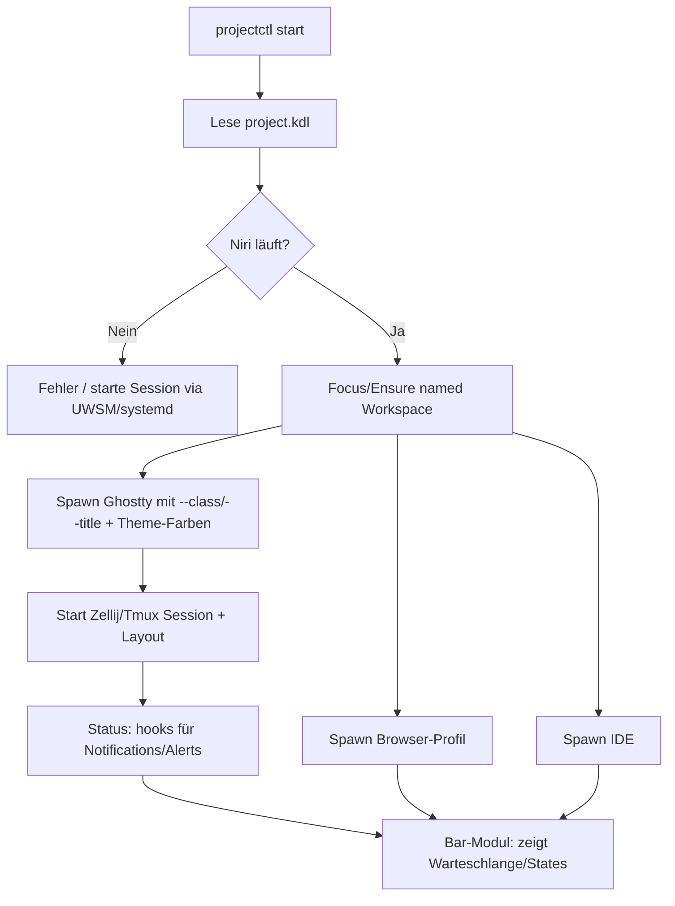
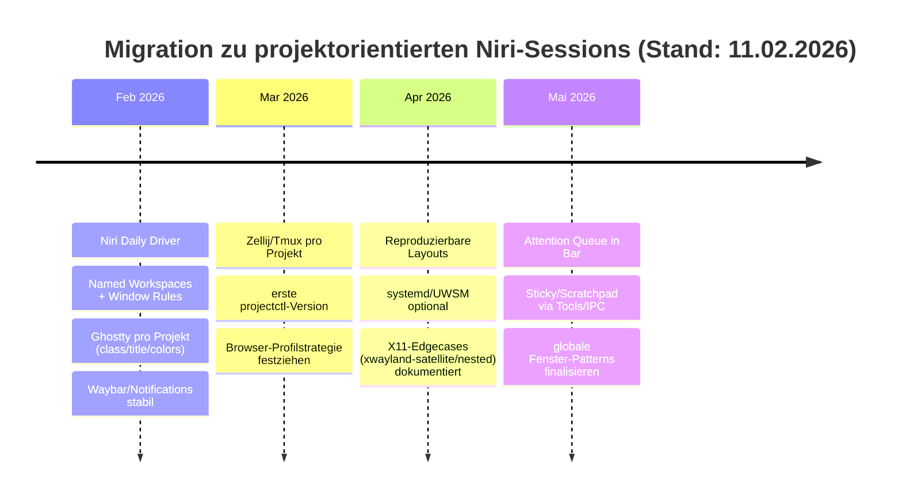

# Projektorientierte Desktop-Workflows mit Niri für parallele AI‑getriebene Arbeit

## Executive Summary

Parallele, AI‑getriebene Arbeit (mehrere gleichzeitige Claude‑Workflows, dazu IDE + Terminal + Browser je Projekt) scheitert in klassischen Desktop‑Metaphern häufig nicht an „Fenster‑Tiling“ an sich, sondern an fehlender **Projekt‑Kohärenz**: Fenster gruppieren sich nicht stabil nach Projekt, Aufmerksamkeit („welche Session braucht mich jetzt?“) wird nicht sichtbar, und das System „zieht“ einen beim App‑Wechseln über Workspaces hinweg. Der von entity["known_celebrity","Theo","x.com/theo"] beschriebene „Agentic Code“-Moment (Notification → unklar *welche* Terminal‑Session fertig wurde → Tab‑/Window‑Hopping) trifft genau dieses Problem. citeturn4search0

Niri adressiert diesen Schmerzpunkt technisch sehr gut, weil es ein **scrolling‑tiling** Modell nutzt: Fenster liegen in Spalten auf einem „unendlichen Streifen“, neue Fenster ändern *nicht* die Größe bestehender Fenster, und pro Monitor gibt es getrennte „Streifen“; Workspaces sind dynamisch und vertikal organisiert. citeturn0search2turn0search14turn1search1turn1search17 Für projektorientierte Workflows ist das ein großer Gewinn: „Projekt = räumlicher Cluster“ wird stabiler als in GNOME‑ähnlichen, app‑zentrierten Switchern. (GNOME‑Workspaces/Öffnen‑an‑falschem‑Workspace ist zudem realer Pain, u.a. in GNOME‑Bug‑Diskussionen dokumentiert.) citeturn4search4turn4search5turn4search7

Was Niri **noch nicht** out‑of‑the‑box löst: „Global windows“ (Mail/Teams/Notizen) als sticky/scratchpad, wirklich „persistente“ Layout‑Restores, und allgemeine Desktop‑Automatisierung wie unter X11 (wmctrl/xdotool‑Denke) – letztere ist eine **Wayland‑Designgrenze**. citeturn22view1turn14search28turn14search9turn14search4turn14search31 Praktiker kompensieren das mit (a) Niri‑Window‑Rules + Named Workspaces + deterministischer Spawn‑Reihenfolge, (b) Niri‑IPC/Event‑Stream für Bar/Indikatoren, sowie (c) Zusatztools (sticky/scratchpad) aus dem Ökosystem. citeturn0search0turn10search1turn16view0turn1search8turn1search0

Die empfohlene Zielarchitektur (ausgerichtet auf deine Präferenz: **Niri + Ghostty für Claude + deklaratives „start‑project“**) ist:  
**Projekt‑Session = Niri‑Workspace (benannt) + Ghostty‑Instanz (eigene Wayland app-id/class + farbiger Titlebar) + Zellij/Tmux‑Session (benannte Tabs/Panes + Status/Alerts) + Browser‑Profilisolierung + systemd/Autostart‑Automatisierung + Status/Notifications via Waybar/SwayNC + Niri‑IPC‑Aggregator.** citeturn10search5turn9view1turn15view0turn7view0turn6search0turn6search2turn6search3turn16view0turn20search2turn20search0

## Kontext und Anforderungen

Der Kern der Anforderung ist nicht „Tiling“, sondern **Projekt‑Orientierung** bei **Parallelität**:

- Mehrere Projekte gleichzeitig: pro Projekt typischerweise *Terminal (Claude Code)* + *IDE* + *Browser* + *Logs/Observability*.
- Mehrere gleichzeitige Claude‑Sessions: entscheidend ist **Aufmerksamkeits-Management** („wer wartet auf Antwort?“) statt nur „Fenster finden“. citeturn4search0
- Wunschbild: ein **deklaratives** `start-project <name>` erzeugt eine stabile Session (Fenster gruppiert, Regeln greifen, Status sichtbar), ohne dass App‑Switching/Workspace‑Sprünge Kontext zerstören.

Niri wird in Praxisberichten genau wegen dieser „Arbeitsfluss‑Passung“ gewählt: Nutzer heben u.a. Scrolling+Tiling+Floating, tabbed columns, Named Workspaces, Multi‑Monitor‑Handling und programmierbare IPC hervor. citeturn21view0turn21view1turn0search2turn16view0

## Wayland vs X: Struktur, Grenzen und Konsequenzen

Wayland ist für deine Zielarchitektur relevant, weil es absichtlich **weniger globale Introspektion/Manipulation** zulässt als X11. Drei Konsequenzen sind besonders „workflow‑tragend“:

Erstens: **Keine globalen Fensterkoordinaten für Clients.** Im Wayland‑Modell kennen Clients die globale Position ihrer Surfaces nicht. citeturn14search28 Das ist nicht nur ein API‑Detail, sondern Design: Wayland ist „nicht ein flacher 2D‑Koordinatenraum“ wie X11, und absolute Positionierung durch Clients ist nicht vorgesehen. citeturn14search16turn14search4turn14search9

Zweitens: **„xdotool/wmctrl“-artige Automation ist nicht 1:1 ersetzbar.** Das wird häufig genau mit Security begründet (Input‑Snooping / Fake‑Input). citeturn14search31turn14search27turn14search19 In der Praxis bedeutet das: „Desktop‑Automation“ wird compositor‑/portal‑spezifisch (IPC, Portals, ggf. libei‑Ökosystem) statt universal‑X11. citeturn16view0turn14search26turn14search37

Drittens: **Gegenbewegung über Portals/Compositor‑IPC.** Für Dinge wie globale Shortcuts existiert ein Portal (org.freedesktop.portal.GlobalShortcuts), das bewusst über Sessions/Registrierung läuft. citeturn14search26 Für dein Ziel („Projekt‑Sessions steuern, Status bauen“) heißt das: Du willst **bewusst** auf (a) Niri‑IPC und (b) systemd/XDG‑Autostart statt auf X11‑Window‑Hacks setzen. citeturn16view0turn20search2

## Niri-Stack: Funktionen, Tooling und offene Baustellen

Niri ist konzeptionell „Wayland‑first“ und bewusst auf ein Flow‑stabileres Fenstermodell optimiert. Zentral sind vier Eigenschaften:

- **Unendlicher horizontaler Strip (Spalten), keine Resizes durch neue Fenster.** Im Projekt‑Readme wird explizit beschrieben: Fenster sind Spalten auf einem unendlichen Streifen; neue Fenster verursachen kein Resizing existierender Fenster. citeturn0search2 Das wird als Designprinzip „Opening a new window should not affect the sizes of any existing windows“ formuliert. citeturn0search14
- **Pro Monitor getrennte Strips + vertikale Workspaces.** Jeder Monitor hat einen separaten Strip; Fenster „überlaufen“ nicht auf den nächsten Monitor. Workspaces sind dynamisch und vertikal organisiert. citeturn0search2turn1search1
- **Regel‑ und Automationsfähigkeit über Window Rules + Named Workspaces.** Window Rules können u.a. nach app-id und title matchen, Workspaces/Outputs zuweisen und mit Start‑/Focus‑Semantik arbeiten (z.B. `open-on-workspace`, `open-on-output`, `open-floating`, `open-focused`). citeturn0search0turn10search19turn10search1 Named Workspaces bleiben bestehen (verschwinden nicht, wenn leer) und sind referenzierbar. citeturn10search5turn10search1
- **Erstklassige Skriptbarkeit via IPC + Event‑Stream.** `niri msg` spricht einen Socket; es gibt einen Event‑Stream, der initial State liefert und danach Updates „push“t, explizit für Bars/Indikatoren ohne Polling. citeturn16view0

image_group{"layout":"carousel","aspect_ratio":"16:9","query":["niri scrolling tiling wayland compositor screenshot","niri overview feature screenshot","niri tabbed column display screenshot"],"num_per_query":1}

Für parallele Projektarbeit heißt das praktisch: Du kannst „Projekt = Workspace‑Name“ erzwingen und Tools (IDE, Ghostty/Claude, Browser) **deterministisch** in diesen Workspace bringen – entweder über Rules (app-id/Title) oder über „Focus Workspace → Spawn Apps“. citeturn0search0turn10search5turn16view0

### Offene Baustellen und wie Praktiker sie kompensieren

Scratchpads/Sticky Windows sind ein gutes Beispiel: Niri hatte/hat dafür lange keine native Funktion. In einer Maintainer‑Antwort wird explizit gesagt: „no scratchpad in niri atm“. citeturn1search0 Auch „sticky/pinned windows“ sind laut FAQ (noch) nicht nativ, aber via Scripts/IPC emulierbar; als Beispiel wird ein Tool genannt, das „follow mode“ anbietet. citeturn22view1

In der Community entstehen daraufhin Ergänzungen: Eine kuratierte „awesome‑niri“ Liste führt u.a. Tools für sticky floating windows und scratchpad‑Support. citeturn1search8turn10search6 Ein konkretes Utility (`niri-float-sticky`) beschreibt explizit: Niri unterstützt globale floating windows nicht nativ; das Tool erzwingt sticky‑Verhalten über alle Workspaces. citeturn1search27

Floating/Tabbed/Overview sind dafür inzwischen sehr solide: Floating Windows sind seit 25.01 dokumentiert; Floating liegt „über“ Tiling und scrollt nicht. citeturn10search3 Tabbed Columns sind seit 25.02 dokumentiert und werden auch in deutscher Berichterstattung hervorgehoben. citeturn10search7turn2search20 Eine Overview‑Ansicht existiert seit 25.05. citeturn10search11

### X11-Kompatibilität: xwayland-satellite statt „klassischem“ XWayland

Für gemischte Toolchains (Teams/Electron, manche IDE‑Plugins, Spezialtools) ist X11‑Kompatibilität wichtig. Niri begründet, warum es XWayland nicht klassisch integriert (u.a. fehlendes globales Koordinatensystem, X11‑Komplexität); seit 25.08 gibt es aber nahtlose Integration über xwayland-satellite. citeturn22view1

Das Xwayland‑Kapitel beschreibt konkret: Niri startet xwayland-satellite on‑demand, setzt `$DISPLAY`, und restarts bei Crash automatisch; Voraussetzung ist eine Mindestversion (>= 0.7). citeturn22view0turn1search6 Gleichzeitig sind Grenzen dokumentiert: X11‑Apps, die harte Screen‑Koordinaten erwarten, verhalten sich nicht korrekt und brauchen ggf. einen nested compositor (z.B. labwc) oder rootful XWayland in einem Fenster. citeturn22view0

Das ist relevant, weil Praktikerberichte reale Reibung zeigen (insbesondere Flatpak/Electron in bestimmten Distros); das muss im Migrationsplan als Risiko eingeplant werden. citeturn21view2turn22view0turn1search25

### Status/Notifications/Layer-Shell: die „Desktop-Hülle“ bewusst bauen

Niri ist kein „Big‑DE“, d.h. du ergänzt Bar, Notifications, Clipboard etc. In den offiziellen Getting‑Started‑Docs wird explizit darauf hingewiesen, dass die Default‑Config Waybar startet, und dass man bei doppelten Bars den spawn‑Eintrag entfernen soll. citeturn7view1turn13view0

Waybar selbst positioniert sich als „highly customizable Wayland bar“ für Sway/wlroots‑Compositors; Niri‑Docs empfehlen Waybar als Startpunkt und erwähnen niri‑spezifische Module. citeturn6search2turn10search33 Für Notifications ist SwayNotificationCenter verbreitet; es setzt wlr‑layer‑shell voraus (wlroots‑basierte Umgebungen) und bietet u.a. Do‑Not‑Disturb, Scripting und Waybar‑Integration. citeturn6search3  
Für Niri‑Spezifika sind **Layer Rules** relevant: Sie erlauben compositor‑seitige Steuerung von layer‑shell Surfaces (Bars/Launcher), analog zu Window Rules. citeturn10search2 Außerdem dokumentiert Niri Stolperstellen: Fullscreen kann Top‑Layer überdecken, und nur Overlay‑Layer ist garantiert „über Fullscreen“. citeturn10search25

## Vergleich und Trade-offs: Niri vs Hyprland, Sway, river, bspwm

Die Alternativen lösen einzelne Teilprobleme „von Haus aus“ besser (z.B. sticky/scratchpad), haben aber andere Kosten (Modellkomplexität, Layout‑Stabilität, externes Layout‑Management). Die folgende Tabelle fokussiert die Eigenschaften, die für projektorientierte Sessions + Automation wichtig sind.

| Compositor/WM | Protokoll | Layout‑Modell | Window Rules / Placement | IPC/Scripting | Scratchpad/Sticky | Typische Stärken | Typische Restprobleme |
|---|---|---|---|---|---|---|---|
| Niri | Wayland | Scrolling columns auf unendlichem Strip; neue Fenster resizen nicht; vertikale dynamische Workspaces; pro Monitor eigener Strip citeturn0search2turn0search14turn1search1 | Umfangreiche Window Rules (app-id/title; open-on-workspace/output; floating/positioning) + Named Workspaces citeturn0search0turn10search1turn10search5 | IPC + Event‑Stream für Indikatoren, JSON‑Zugriff über Socket citeturn16view0 | Nativ: (noch) keine „sticky/scratchpad“; via Tools/IPC emulierbar citeturn22view1turn1search8 | Sehr stable „Projekt‑Cluster“, gute räumliche Gedächtnis‑Anker, gute docs/Community‑Resonanz citeturn21view0turn21view1 | X11 über xwayland-satellite: Limits bei Apps mit absoluten Koordinaten; Ökosystem nötig (Bar/Notif/…) citeturn22view0turn22view1turn6search2 |
| Hyprland | Wayland | Dynamisch/animiert, mehrere Layouts; „Special Workspace“ als Scratchpad‑Konzept citeturn2search1 | Sehr flexible Window Rules (u.a. workspace/monitor, pin für „show on all workspaces“) citeturn2search5 | hyprctl + Sockets; Warnung vor Spam/Sync‑Calls citeturn2search13 | Built‑in: Special workspace; Pin (floating) citeturn2search1turn2search5 | Viele Features „out of box“, starkes Community‑Ökosystem | Komplexität/Beweglichkeit kann „Projekt‑Stabilität“ kosten; zusätzliche moving parts (Regeln/Layouts) citeturn2search13 |
| Sway | Wayland | i3‑kompatibel, grid/containers, tiling manuell/semimanual citeturn2search38turn2search10 | `assign`/`for_window` Kriterien (workspace/output) gut dokumentiert citeturn2search10 | IPC (JSON‑Socket) + i3‑Paradies für Scripter (compositor‑spezifisch) citeturn2search10turn19search2 | i3‑ähnliche Mechanismen (scratchpad je nach Konzept/Tools) | Reife, Vorhersagbarkeit, riesiges i3‑Wissen wiederverwendbar citeturn2search38 | Placement/Rules bei Wayland/Xwayland/Electron manchmal edge‑case‑lastig (siehe Issues/Threads) citeturn2search2turn2search14turn2search34 |
| river | Wayland | „Dynamic tiling“, aber ohne eingebaute Layouts; external layout generator (z.B. rivertile) citeturn2search11turn2search27 | Regeln via riverctl; Doku über riverctl manpage; orientiert an app-id/title/tags/output citeturn2search39turn19search16 | riverctl + „init“ als ausführbares Script; sehr hackbar citeturn2search39turn2search7 | Abhängig von Tooling/Setup | Extrem modular (ähnlicher Geist wie bspwm), für Bastler attraktiv citeturn2search11turn2search7 | Mehr Eigenbau: Layout‑Generator, Regeln, Bar/Notif etc. müssen konsequent gebaut werden citeturn2search11 |
| bspwm | X11 | Binary space partitioning tree; WM reagiert nur auf X‑Events und wird über Socket‑Messages gesteuert citeturn19search0 | X11‑Ökosystem: wmctrl/xdotool‑artige Automation grundsätzlich einfacher möglich (X‑zentriert) citeturn19search0turn14search31 | Steuerung via bspc; Keybinding‑Daemon separat (sxhkd) citeturn19search0 | Je nach Tools/Script | Maximale Scriptbarkeit im X11‑Paradigma; sehr „Unix‑Philosophie“ citeturn19search0 | Nicht Wayland‑native; langfristige Richtung vieler Distros/DEs geht zu Wayland (Portals/…) citeturn14search28turn2search32 |

**Interpretation für dein Ziel:** Hyprland löst sticky/scratchpad „nativ“ angenehmer; Sway ist stabil und gut dokumentiert; river/bspwm sind modular, aber mehr Eigenbau. Niri ist am stärksten, wenn dein primäres Ziel **Projekt‑Cluster‑Stabilität + räumliches Navigieren** ist und du bereit bist, fehlende Komfortfunktionen über IPC/Tools nachzuziehen. citeturn0search2turn16view0turn1search8turn21view0

## Empfohlene Architektur und Migrationspfad

### Zielbild: „Project Sessions“ als First-Class Concept

**These:** In deinem Setup sollte „Projekt“ eine *Session* sein, die folgende Zustände *deterministisch* bindet:

- Niri: Workspace‑Name + (optional) Ziel‑Output/Monitor.
- Ghostty: pro Projekt eine Instanz mit eigener Wayland app-id (Ghostty „class“) + farblichem Titlebar + statischem Titel.
- Multiplexer: pro Projekt eine Zellij‑ oder tmux‑Session mit Layout/Pane‑Namen (Claude, Logs, Shell, …).
- Browser: ein isoliertes Profil (mind. eigener User‑Data‑Dir / eigener Firefox‑Profil‑Start, je nachdem), plus visuelle Markierung (Theme/Containerfarbe).
- Ein „Statuskanal“: Notifications + Bar‑Indicator, der *Projekt → Wartend/Running* sichtbar macht.

Das lässt sich bauen, weil Ghostty relevante Identitäts‑Schalter anbietet:  
`class` setzt u.a. **Wayland application ID** (und DBus‑Busname), und `title` kann als erzwungener Window‑Title dienen; zudem kann Ghostty Titlebar‑Farben konfigurieren (GTK runtime, wenn window-theme=ghostty). citeturn9view1turn15view0turn0search15  
Auf Niri‑Seite matchen Window Rules genau auf solche app-id/title‑Merkmale und können Placement/Focus/Floating steuern. citeturn0search0turn10search19

### Referenzarchitektur: Komponenten

**Window Manager/Session**
- Niri als Compositor.
- Optional: UWSM als „Session‑Wrapper“, wenn du robustes systemd‑Target‑Handling, Environment‑Management und XDG‑Autostart standardisiert willst. (UWSM tut genau das: Wayland‑Compositor via systemd‑User‑Units starten, Environment/XDG‑Autostart/Clean Shutdown.) citeturn20search12turn20search4turn20search0

**Bar + Notifications**
- Waybar für Status/Workspaces/Custom Modules. citeturn6search2turn10search33
- SwayNotificationCenter als Notification „Control Center“ (falls kompatibel in deinem Stack; benötigt wlr‑layer‑shell). citeturn6search3turn10search2

**Terminal + Multiplexing**
- Ghostty als Terminal (pro Projekt visuell markiert), darin:
  - Zellij (Layouts sind KDL; Start via `zellij --layout …`) citeturn7view0  
  - oder tmux (set-titles und Status/Alerts sind sehr reif). citeturn6search0turn6search12

**Browser-Isolation**
- Firefox: Multi‑Account Containers (cookie‑getrennte „color‑coded tabs“) sind ein praktikables Isolation‑Muster, wenn du *im gleichen Profil* trennen willst. citeturn17search1turn17search27  
- Firefox: echte Profiltrennung via Profile Manager/`-P` + `-no-remote` (zweite Instanz) wird in Mozilla‑Support/Docs breit diskutiert, ist aber ergonomisch tricky bzgl. „Default browser“‑Links. citeturn18search2turn18search1turn18search14turn18search19  
- Chromium/Chrome: separater User‑Data‑Dir/Profilpfade sind dokumentiert; `--user-data-dir` erzeugt ein separates „fresh install“ Profil und wird als Debug/Isolation‑Mechanismus beschrieben. citeturn17search32turn17search2

### Vergleichstabelle: Session-/Autostart-Mechaniken

| Mechanik | Was sie gut kann | Was sie schlecht kann | Wann ich sie in deinem Zielbild nutze |
|---|---|---|---|
| Niri `spawn-at-startup` | Einfach, WM‑nah; gut für Bar/Daemon‑Basics. Default‑Config dokumentiert Muster und erwähnt Waybar‑Start. citeturn13view0turn7view1 | Begrenzte Orchestrierung/Dependencies; weniger „declarative infra“ | Für *Desktop‑Grunddienste* (Bar, Notif‑Daemon, Clipboard, Lock) |
| XDG Autostart (.desktop) | Standardisierte Autostart‑Spezifikation (freedesktop); user overrides möglich. citeturn20search2turn20search6 | Weniger „Projekt‑kontextuell“; Debug/Ordering manchmal nervig | Für „immer“‑Dienste, die nicht projektabhängig sind |
| systemd --user Units | Dependencies, Restart‑Policy, Logging (journalctl), klare Targets | Wayland‑Environment/Targets können gotchas haben; SESSION‑Env muss stimmen | Für „start-project“ als Units/Scopes, plus robuste Lifecycle‑Steuerung |
| UWSM | Baut genau die Brücke: Compositor‑Start als systemd‑Units + env + XDG Autostart + clean shutdown. citeturn20search12turn20search4turn20search0 | „Advanced users“ Tooling, zusätzliche Quirks/Komplexität | Wenn du *wirklich* reproduzierbare Sessions willst (und systemd magst) |
| „Ein Script“ (`projectctl`) | Maximale Flexibilität, direkt auf Niri IPC/Event‑Stream | Du wartest selbst (Race conditions, retries), maintenance | Für deklaratives „start-project“, das Fenster/Workspaces orchestriert |

### Konkretes Implementierungsmuster: deklaratives `start-project`

Ein praktikabler Ansatz ist ein kleines Projekt‑Manifest (z.B. KDL, weil auch Niri/Zellij KDL sprechen) plus ein `projectctl`, das:

1) Workspace (named) fokussiert/erstellt  
2) Ghostty mit projekt-spezifischer app-id + Titlebar‑Farbe startet  
3) darin Zellij/tmux Session mit Layout startet  
4) Browser‑Profil startet  
5) IDE startet  
6) einen Status‑Collector startet, der Claude‑Aufmerksamkeit sichtbar macht (Bar + Notifications)

**Warum KDL?** Zellij verwendet KDL für Layouts. citeturn7view0 Niri configs sind ebenfalls KDL. citeturn10search4turn7view1 Das reduziert Format‑Sprawl.

Beispiel‑Flow (Mermaid):

**Bausteine, die das konkreter machen:**

- Niri: IPC/Event‑Stream ist ausdrücklich für „bars and indicators“ gedacht („complete current state up-front, then updates“) – ideal für dein „welche Session wartet?“‑Problem. citeturn16view0  
- Ghostty: `class` steuert Wayland app-id → daraus werden Niri Window Rules stabiler. citeturn9view1  
- Ghostty: Titlebar‑Farben erlauben harte visuelle Projekt‑Kodierung (z.B. pro Projekt eine Farbe). citeturn15view0turn0search15  
- Zellij: Layouts lassen sich beim Start anwenden (`zellij --layout …`) und sind KDL. citeturn7view0  
- tmux: kann Terminal‑Title automatisch setzen und Alerts in Title/Status reflektieren (wichtig als Aufmerksamkeitskanal). citeturn6search0turn6search12  
- Zellij: Plugins wie zjstatus bieten anpassbare Statusbar inkl. Widgets (u.a. „notifications“, „session“). citeturn6search9

### Fensterregeln und Layout-Reproduzierbarkeit in Niri

**Placement:** Niri kann pro app-id/title u.a. Workspace/Output festlegen (`open-on-workspace`, `open-on-output`) und zudem Floating/Fullscreen/Focus‑Policy steuern. citeturn0search0turn10search19  
Für Reproduzierbarkeit ist die Spawn‑Reihenfolge wichtig, weil neue Fenster rechts vom Fokus entstehen (praktisch: deterministische Reihenfolge = deterministische Strip‑Anordnung). citeturn1search17

**Persistenz:** Named Workspaces verschwinden nicht, auch wenn leer, und können dynamisch benannt werden. citeturn10search5turn10search1 Damit lässt sich mindestens die „Projekt‑Landkarte“ (Workspace‑Namen) stabil halten; „exakte Fensterpositionen“ im X11‑Sinne sind in Wayland bewusst kein Standardfeature. citeturn14search28turn14search9

### Pattern: globale Fenster (Mail, Teams, Obsidian) ohne Kontextzerstörung

Da Niri (noch) kein echtes „sticky across workspaces“ nativ bietet, sind in der Praxis drei Muster verbreitet:

**Dedizierter „Global“-Workspace**  
Mail/Teams/Notizen laufen in einem benannten Workspace `comm` oder `global`; per Hotkey springst du dorthin. Placement geht über `open-on-workspace`. citeturn0search0turn10search5turn10search1  
Das löst „ständig sichtbar“ nicht, aber macht es auffindbar und verhindert Projekt‑Vermischung.

**Zweiter Monitor als „Global Screen“**  
Weil Niri pro Monitor eigene Strips hat und Fenster nicht auf den anderen Monitor „überlaufen“, kannst du bewusst einen Monitor für „always on“ Kommunikation reservieren (Teams call + Mail). citeturn0search2turn21view0  
Konfig‑Tools für Monitorprofile (falls Docking relevant) werden häufig über kanshi gelöst (Wayland‑Äquivalent zu autorandr; braucht wlr-output-management). citeturn20search3turn20search7

**Sticky Floating via Zusatztool**  
Wenn du „Teams Call Mini‑Window“ wirklich über alle Workspaces willst: `niri-float-sticky` beschreibt genau dieses Ziel („Niri doesn’t natively support global floating windows“) und erzwingt sticky‑Verhalten. citeturn1search27  
Ähnlich für „scratchpad“ existieren Community‑Tools, gebündelt in awesome‑niri. citeturn1search8turn1search0

### Aufmerksamkeit für mehrere Claude-Sessions: Tagging, Notifications, visuelle Codierung

**Tagging (identifizierbar machen, *welches* Terminal/Claude)**  
- Ghostty `class` (Wayland app-id) pro Projekt setzen und in Niri Window Rules darauf matchen. citeturn9view1turn0search0  
- Ghostty `title` pro Projekt erzwingen (z.B. `CLAUDE: COMET`). citeturn9view1  

**Visuelle Codierung (ohne „Fenstertitel lesen“)**
- Ghostty Titlebar‑Farben pro Projekt setzen (z.B. „COMET = orange“, „Projekt B = blau“). citeturn15view0turn0search15  
- In Niri kann zusätzlich Aufmerksamkeit über „urgent“‑Border‑Color sichtbar werden (Default‑Config erläutert „urgent-color“ für „windows that request your attention“). citeturn13view0

**Notifications (wenn Claude/Workflow fertig ist oder „input required“)**
- In Ghostty kann „desktop-notifications“ für Terminal‑Apps via Escape Sequences aktiviert sein; das ist ein direktes Vehikel, aus einer CLI‑Session Desktop‑Notifications zu erzeugen. citeturn15view1  
- Alternativ/ergänzend: system notifications über dein Notification Center (z.B. SwayNotificationCenter mit Do‑Not‑Disturb und Scripting). citeturn6search3  

**Status/Queue‑Indicator (die eigentliche Lösung für „wer wartet?“)**  
- Niri IPC Event‑Stream ist explizit für „bars and indicators“ gedacht (push statt polling). citeturn16view0  
- Waybar ist als hochgradig anpassbare Wayland‑Bar etabliert; Niri‑Docs erwähnen explizit niri‑Module in Waybar. citeturn6search2turn10search33  

Ein praktikables Muster ist: `projectctl` startet für jedes Projekt einen kleinen „state emitter“ (z.B. eine Datei/Socket pro Projekt), der bei „Claude wartet“ ein Flag setzt; Waybar zeigt aggregiert `COMET: 1 waiting | PROJ-B: 0 | …`. Das ist nicht „Wayland‑Standard“, aber genau die Art Integration, für die Niri den Event‑Stream anbietet. citeturn16view0

### Migration als Plan: kurz, mittel, lang

**Kurzfristig (bis Ende Februar 2026):** Niri als täglicher Driver, Fokus auf „Projekt‑Clustering“  
- Niri installieren, Named Workspaces einführen, Window Rules für die Kernapps definieren. citeturn10search5turn0search0turn10search1  
- Ghostty pro Projekt via `--class`/`--title`/Titlebar‑Farben starten (manuell, noch ohne Automatisierung). citeturn9view1turn15view0turn0search15  
- Bar/Notifications stabilisieren (Waybar + Notification Daemon). citeturn7view1turn6search2turn6search3  
- X11‑Abhängigkeiten testen: xwayland-satellite Integration (Niri 25.08+), sowie Sonderfälle „Apps mit absoluten Koordinaten“ identifizieren. citeturn22view0turn22view1turn1search25

**Mittelfristig (März bis April 2026):** deklaratives `start-project` + Multiplexer‑Layouts  
- Zellij‑Layouts (KDL) pro Projekt definieren und in Ghostty starten. citeturn7view0  
- oder tmux‑Sessions pro Projekt mit Titles/Alerts (set-titles) zur Aufmerksamkeit. citeturn6search0turn6search12  
- Browser‑Isolation konsequent: (a) Firefox Containers für schnelle Trennung, oder (b) separate Profile/Instanzen, wenn du harte Trennung brauchst. citeturn17search1turn17search27turn18search2turn18search14  
- `projectctl` implementieren: Niri IPC (focus workspace, spawn) + deterministic ordering. citeturn16view0turn13view0  

**Langfristig (Mai 2026+):** Attention‑System (Queue) + „Global windows“ ergonomisch  
- Waybar‑Modul oder separater Indicator, der Niri Event‑Stream nutzt und Projekt‑States anzeigt. citeturn16view0turn6search2  
- Sticky/scratchpad sauber lösen: entweder via Community‑Tools (niri-float-sticky, niri-scratchpad‑Ansätze aus awesome‑niri) oder via eigener IPC‑Controller. citeturn1search27turn1search8turn1search0  
- Optional: Session‑Robustheit via UWSM/systemd, wenn Lifecycle/Env‑Gotchas nerven oder du „infra‑artige“ Reproduzierbarkeit willst. citeturn20search12turn20search4turn20search0  

Migration als Mermaid‑Timeline:

**Ein letzter Realitätscheck:** Der größte technische Unsicherheitsfaktor ist nicht Niri selbst, sondern die Kombinatorik aus Wayland‑Constraints + App‑Spezialfällen (X11‑Koordinaten‑Apps, Flatpak‑Eigenheiten, Notification Daemons mit layer‑shell‑Annahmen). Niri dokumentiert diese Grenzen und Workarounds (nested compositor, rootful XWayland), aber du solltest sie früh in deiner Toolchain validieren. citeturn22view0turn14search28turn14search9turn6search3