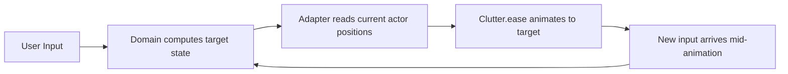

# Kestrel Product Design

Kestrel is a GNOME Shell extension that replaces GNOME's default window management with a scrolling tiling model. Windows are arranged on a two-dimensional plane; navigation is viewport movement through that plane.

## Core Concept: The World

The World is a two-dimensional plane of windows. Your monitor (or monitors) act as a viewport -- a camera looking at a portion of the plane. All navigation moves the viewport through the World.

```
                    THE WORLD
    ┌──────────────────────────────────────────────┐
    │ WS 0:   A   B   C   D   E   F               │
    │                                              │
    │ WS 1:   G   H   I   J                       │
    │              ┌────────────────┐              │
    │ WS 2:   K   │ L   [M]   N   │  O            │
    │              └────────────────┘              │
    │ WS 3:   P   Q                               │
    │                                              │
    │ WS 4:   (empty — trailing workspace)         │
    └──────────────────────────────────────────────┘
                   ▲               ▲
                   └── viewport ───┘
```

The viewport currently shows workspace 2. Window M has focus (indicated by `[M]`). Workspaces extend horizontally; the viewport scrolls to keep the focused window visible. Pressing Super+Up moves the viewport to workspace 1; Super+Down moves to workspace 3.

## Workspaces

Workspaces are independent horizontal strips stacked vertically. Each workspace holds zero or more windows arranged left to right.

Kestrel workspaces are **virtual** -- all windows live on a single GNOME workspace. Kestrel owns the entire 2D plane and manages visibility, focus, and positioning itself. This avoids conflicts with GNOME's built-in workspace animation system.

**Dynamic growth:** There is always exactly one empty workspace at the bottom. When a window is added to the trailing empty workspace, a new empty workspace appears below it. When a workspace in the middle becomes empty (all its windows are closed or moved), it is removed and indices shift down. This keeps the workspace list compact with no gaps.

**Workspace names:** Workspaces can be assigned names for identification in overview mode and for text-based navigation with the type-to-filter feature.

## Windows

Windows are arranged left to right within their workspace.

- **Default width:** One column (`monitorWidth / columnCount`), occupying 1 slot.
- **Full width:** Toggled with Super+F. A full-width column spans `columnCount` slots (the entire viewport width).
- **Stacking:** Multiple windows can share a column, splitting the height equally. Use `Super+J` to stack/unstack. In the textual notation, `/` separates stacked windows: `A/B` means A above B in the same column.
- **Placement:** New windows are appended as a new single-window column to the right end of the current workspace.
- **Focus:** New windows receive focus immediately.
- **Minimum size:** If a window refuses to resize to column width, it is automatically promoted to full-width.

## Window Closing

When a window closes:

- Remaining windows shift left to fill the gap.
- Focus moves to the next window to the right. If there is no next window, focus moves to the previous window.
- Multiple simultaneous closes are coalesced into a single animation.

```
Before:   A   B   [C]   D   E       (C is focused, C closes)

After:    A   B   [D]   E           (D gets focus, fills the gap)
```

## Slot Model

Every workspace has a logical slot grid. One slot equals `monitorWidth / columnCount` pixels (default `columnCount` is 2, configurable 1--6 via GSettings). This grid determines how windows are positioned and how vertical navigation targets windows.

- Default-width window = 1 slot (one column)
- Full-width window = `columnCount` slots (fills the entire viewport)
- Slot index of a window = the first slot it occupies (its left edge), 1-based

```
Slots:     1      2      3      4      5
         ┌──────┬──────┬──────┬──────┬──────┐
         │  A   │  B   │   C (full)  │  D   │
         │ 1slt │ 1slt │   2 slots   │ 1slt │
         └──────┴──────┴──────────────┴──────┘
Indices:   s=1    s=2      s=3         s=5
```

Window A occupies slot 1 (index 1). Window B occupies slot 2 (index 2). Window C is full-width and occupies slots 3--4 (index 3). Window D occupies slot 5 (index 5).

### Columns and Stacking

Windows are organized into **columns**. Each column occupies one or more slots and contains one or more vertically stacked windows. A column with a single window behaves identically to the traditional flat model.

When a column contains multiple windows, they share the column's height equally (minus gaps between them). Stacking is always an explicit user action via `Super+J`.

```
Column with 1 window:         Column with 3 stacked windows:
┌──────────────┐              ┌──────────────┐
│              │              │      A       │
│      A       │              ├──────────────┤
│              │              │      B       │
│              │              ├──────────────┤
└──────────────┘              │      C       │
                              └──────────────┘
```

New windows always create a new single-window column. Stacking is built up incrementally with `Super+J`.

## Focus

Exactly one window in the World has focus at any time. The focused window determines:

- Which window is active (receives keyboard input).
- Where the viewport is positioned (viewport scrolls to keep the focused window visible).

The focus indicator is a teal highlight overlay rendered on top of the focused window:

| Property | Default |
|---|---|
| Background color | `rgba(125,214,164,0.05)` |
| Border color | `rgba(125,214,164,0.8)` |
| Border width | 3px |
| Border radius | 8px |

All focus indicator properties are configurable via GSettings.

## Gaps

Gaps provide visual spacing between windows and screen edges.

| Gap | Default | Setting |
|---|---|---|
| Between windows | 8px | `gap-size` |
| Screen edges | 8px | `edge-gap` |

Gaps are a visual layout concern. The slot model is independent of gaps -- slot positions account for gaps when computing pixel coordinates, but the slot indices themselves do not change.

## Viewport

The viewport is the visible area across all connected monitors. Multiple monitors form a single combined viewport.

The viewport is a 2D camera into the World with two coordinates:

- **X position** -- horizontal scroll offset within the current workspace
- **Y position** -- which workspace is displayed

### Horizontal scrolling

The viewport scrolls horizontally in the minimum increment needed to keep the focused window fully visible (**scroll-to-fit**). It does not center the focused window. If the focused window is already visible, the viewport does not move.

### Vertical movement

Switching workspaces (Super+Down/Up) changes the Y position. This is a single simultaneous 2D animation from the current position `(x, y)` to the target position `(x', y')`, where `x'` is determined by the target window's position in the new workspace.

## Keyboard Navigation

All keybindings are configurable via GSettings. These are the defaults:

| Keybinding | Action |
|---|---|
| Super+Right | Focus next column |
| Super+Left | Focus previous column |
| Super+Down | Focus down: within stack first, then switch to workspace below |
| Super+Up | Focus up: within stack first, then switch to workspace above |
| Super+Alt+Down | Force switch to workspace below (bypasses stack navigation) |
| Super+Alt+Up | Force switch to workspace above (bypasses stack navigation) |
| Super+F | Toggle focused column between 1-slot and full-viewport width (`columnCount` slots) |
| Super+J | Toggle stack/unstack (join focused window with left neighbor column, or pop out) |
| Super+Shift+Right | Move focused column right (swap) |
| Super+Shift+Left | Move focused column left (swap) |
| Super+Shift+Down | Move down: reorder within stack first, then move to workspace below |
| Super+Shift+Up | Move up: reorder within stack first, then move to workspace above |
| Super+Minus | Toggle overview mode |
| Super+N | Open new window of focused app |
| Super+BackSpace | Close focused window |
| Super+Period | Toggle notification focus mode |
| Super+Apostrophe | Show keyboard shortcuts help |
| Super+W | Toggle quake slot 1 |
| Super+E | Toggle quake slot 2 |
| Super+R | Toggle quake slot 3 |
| Super+T | Toggle quake slot 4 |
| Super+Z | Toggle quake slot 5 |

### Boundary Behavior

All navigation is a no-op at boundaries:

- Super+Left on the leftmost window: no-op
- Super+Right on the rightmost window: no-op
- Super+Up on workspace 0: no-op
- Super+Down on the trailing empty workspace: no-op
- Super+Shift at edges: no-op

## Horizontal Navigation: Super+Left / Super+Right

Moves focus to the previous or next window in the current workspace.

- If the newly focused window is already visible in the viewport: only focus changes, viewport stays.
- If the newly focused window is outside the viewport: the viewport slides horizontally to bring it into view.

## Vertical Navigation: Super+Down / Super+Up

Moves the viewport to the workspace below or above. The target window in the new workspace is determined by the **slot-based targeting rule:**

> Find the window in the target workspace whose slot range contains the first slot index of the source window.

```
Slots:      1      2      3      4      5
          ┌──────┬──────┬──────┬──────┬──────┐
WS 0:     │  A   │   B (full)  │  C   │      │
          └──────┴─────────────┴──────┘      │
WS 1:     │  D   │  E   │  F   │  G   │  H   │
          └──────┴──────┴──────┴──────┴──────┘
WS 2:     │     I (full)  │     J (full)  │
          └───────────────┴───────────────┘

Focus Down mappings (WS 0 → WS 1):
  A (s=1) → D (s=1)        Slot 1 falls in D's range [1]
  B (s=2) → E (s=2)        Slot 2 falls in E's range [2]
  C (s=4) → G (s=4)        Slot 4 falls in G's range [4]

Focus Down mappings (WS 1 → WS 2):
  D (s=1) → I (s=1)        Slot 1 falls in I's range [1,2]
  E (s=2) → I (s=1)        Slot 2 falls in I's range [1,2]
  F (s=3) → J (s=3)        Slot 3 falls in J's range [3,4]
  G (s=4) → J (s=3)        Slot 4 falls in J's range [3,4]
  H (s=5) → no match       No window covers slot 5; rightmost window J gets focus

Focus Up mappings (WS 2 → WS 1):
  I (s=1) → D (s=1)        Slot 1 falls in D's range [1]
  J (s=3) → F (s=3)        Slot 3 falls in F's range [3]
```

**Empty workspace:** If the target workspace is empty, the viewport moves there but nothing receives focus. Super+Up returns to the previous workspace.

## Window Moving: Horizontal (Super+Shift+Left / Super+Shift+Right)

Swaps the focused window with its neighbor. The focused window jumps past the neighbor regardless of either window's size. Focus stays on the moved window; the viewport adjusts if needed.

```
Before:   A   [B]   C   D           (B is focused)

Super+Shift+Right:

After:    A   C   [B]   D           (B and C swapped, B keeps focus)
```

## Window Moving: Vertical (Super+Shift+Down / Super+Shift+Up)

Sends the focused window to the workspace below or above. The window is inserted before the window matching the slot-based targeting rule. Focus follows the moved window.

```
Slots:     1      2      3      4
         ┌──────┬──────┬──────┬──────┐
WS 0:    │  A   │ [B]  │  C   │      │    B is focused at slot 2
         └──────┴──────┴──────┘      │
WS 1:    │  D   │  E   │  F   │  G   │
         └──────┴──────┴──────┴──────┘

Super+Shift+Down:

WS 0:    │  A   │  C   │             │    B removed, C shifts left
         └──────┴──────┘             │
WS 1:    │  D   │ [B]  │  E   │  F   │  G │   B inserted before E (slot 2)
         └──────┴──────┴──────┴──────┴────┘
```

## Window Resizing: Super+F

Toggles the focused column between 1-slot width and full-viewport width (`columnCount` slots). This does not displace neighbors -- the strip simply grows or shrinks.

For the default 2-column setup, this behaves identically to the previous half/full toggle. For 3+ columns, Super+F makes a column span the full viewport rather than just doubling.

```
Before:   A   [B]   C   D           (B is 1-slot)

Super+F:

After:    A   [  B  ]   C   D       (B now spans columnCount slots, strip is wider)

Super+F again:

After:    A   [B]   C   D           (B returns to 1-slot)
```

## Maximize and Fullscreen

**Maximize:** Kestrel intercepts the maximize action and converts it to a width toggle. A maximized window becomes full-viewport-width (`columnCount` slots), equivalent to Super+F on a 1-slot column. The window remains in the tiling strip.

**Fullscreen:** The window steps out of the tiling strip and covers the monitor edge to edge with no gaps or panel.

- Remaining windows in the workspace rearrange as if the window was removed.
- Focus stays on the fullscreen window.
- Exiting fullscreen: the window returns to its strip position.

## Mouse Interaction

| Input | Action |
|---|---|
| Click on window | Focus that window (passive, handled by GNOME) |
| Super+Scroll | Navigate windows and workspaces |

### Super+Scroll Details

The Super key must be held for scroll navigation to take effect.

**Discrete scroll (mouse wheel):** Each detent click produces one focus change.

- Scroll down: focus next window (right)
- Scroll up: focus previous window (left)

**Smooth scroll (trackpad):** Both axes are tracked independently.

- Horizontal axis (dx): focus left/right. Threshold: 1.0 scroll delta units.
- Vertical axis (dy): workspace up/down. Threshold: 1.0 scroll delta units.
- Both axes accumulate independently and can trigger simultaneously (diagonal swipe).
- Accumulation resets when Super is released or after 300ms of inactivity.

## Overview Mode (Super+Minus)

Overview mode shows a zoomed-out bird's-eye view of the entire World. All workspaces are displayed as scaled-down thumbnails with workspace names.

```
┌─────────────────────────────────────────────────┐
│                                                 │
│   WS 0 "main"     ┌─┐ ┌─┐ ┌───┐               │
│                    │A│ │B│ │ C │               │
│                    └─┘ └─┘ └───┘               │
│                                                 │
│   WS 1 "chat"     ┌─┐ ┌─┐                     │
│                    │D│ │E│                     │
│                    └─┘ └─┘                     │
│                                                 │
│   WS 2 "docs"     ┌───┐ ┌─┐                   │
│                    │[F]│ │G│  <-- focused       │
│                    └───┘ └─┘                   │
│                                                 │
└─────────────────────────────────────────────────┘
```

### Overview Navigation

| Input | Action |
|---|---|
| Arrow keys | Move focus across the 2D grid |
| Enter or Super+Minus | Exit overview, animate to selected window |
| Escape | Exit overview, return to previously focused window (no change) |
| Click on thumbnail | Jump to that window |

### Type-to-Filter

Start typing in overview mode to fuzzy-match workspace names. Non-matching workspaces are hidden; matching workspaces collapse together.

Fuzzy match scoring:

| Factor | Weight |
|---|---|
| First character match | +10 |
| Consecutive character match | +8 |
| Word boundary match | +5 |
| Any character match | +1 |
| Excess unmatched characters | -0.5 |

- Backspace removes the last filter character.
- Escape clears the filter text. A second Escape cancels overview mode.
- Arrow keys navigate within the filtered set.
- Enter confirms the current filtered selection.

### Workspace Rename

Press F2 in overview mode to open an inline text entry on the focused workspace name.

- Pre-filled with the current name, fully selected.
- Enter saves the name; Escape cancels.
- Typing does NOT trigger filtering while rename is active.

## Animation

All transitions are smoothly animated. Every navigation action is a viewport move through the World.

Rapid input produces smooth curves via Clutter.ease() retargeting. When a new animation starts before the previous one finishes, the animation system smoothly redirects from the current intermediate position to the new target. There is no queuing and no snapping.



## Quake Console

Quake console provides up to 5 hotkey-bound application slots (Super+W/E/R/T/Z) that overlay-float in from the top of the screen, like the classic Quake terminal. Each slot can be configured with a desktop app ID. Only one quake overlay is visible at a time; pressing the same hotkey again dismisses it. If no matching window exists, the configured app is launched automatically. Configured apps are pre-launched on startup so they are ready instantly. External focus changes (clicking a tiled window) dismiss the visible overlay.

Quake windows are managed by the domain as a separate category alongside tiled windows — they do not occupy workspace slots or participate in tiling layout. Full specification: `docs/feature/quake-console.md`.

## Configuration

All settings are configurable via GSettings under the schema `org.gnome.shell.extensions.kestrel`.

### Layout Settings

| Setting | Default | Key |
|---|---|---|
| Columns per viewport | 2 | `column-count` |
| Gap between windows | 8px | `gap-size` |
| Gap at screen edges | 8px | `edge-gap` |

### Focus Indicator Settings

| Setting | Default | Key |
|---|---|---|
| Border width | 3px | `focus-border-width` |
| Border color | `rgba(125,214,164,0.8)` | `focus-border-color` |
| Background color | `rgba(125,214,164,0.05)` | `focus-background-color` |
| Border radius | 8px | `focus-border-radius` |

### Quake Console Settings

| Setting | Default | Key |
|---|---|---|
| Quake slot 1 app ID | (empty) | `quake-slot-1` |
| Quake slot 2 app ID | (empty) | `quake-slot-2` |
| Quake slot 3 app ID | (empty) | `quake-slot-3` |
| Quake slot 4 app ID | (empty) | `quake-slot-4` |
| Quake slot 5 app ID | (empty) | `quake-slot-5` |
| Quake window width | 80% | `quake-width-percent` |
| Quake window height | 80% | `quake-height-percent` |

### Debug Settings

| Setting | Default | Key |
|---|---|---|
| Debug mode | false | `debug-mode` |

All keybindings listed in the Keyboard Navigation section are also configurable via GSettings.
