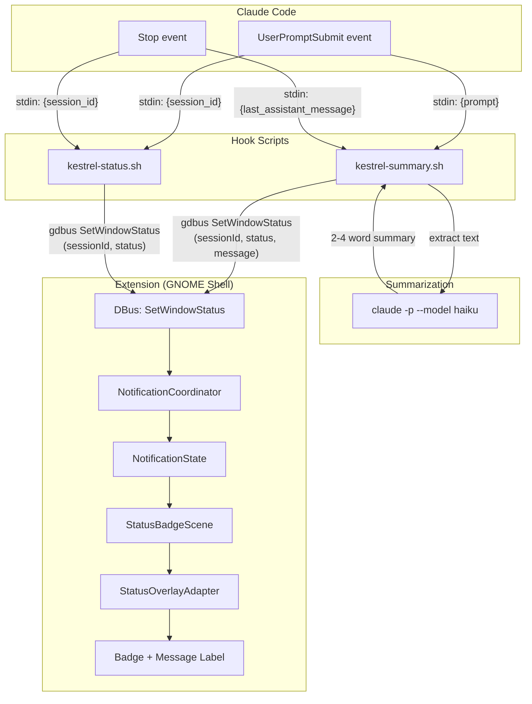
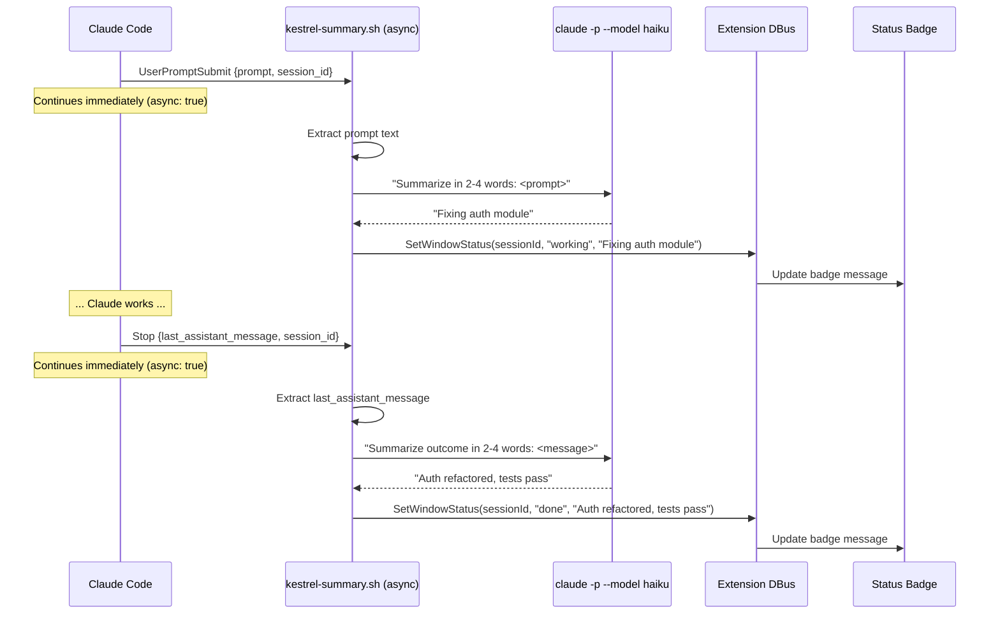
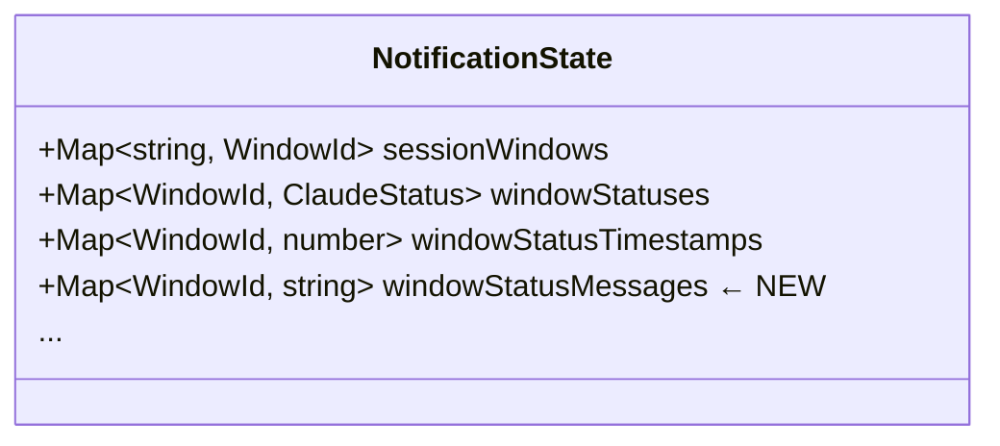
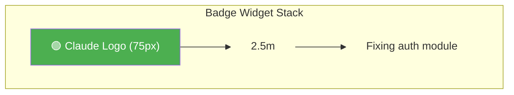
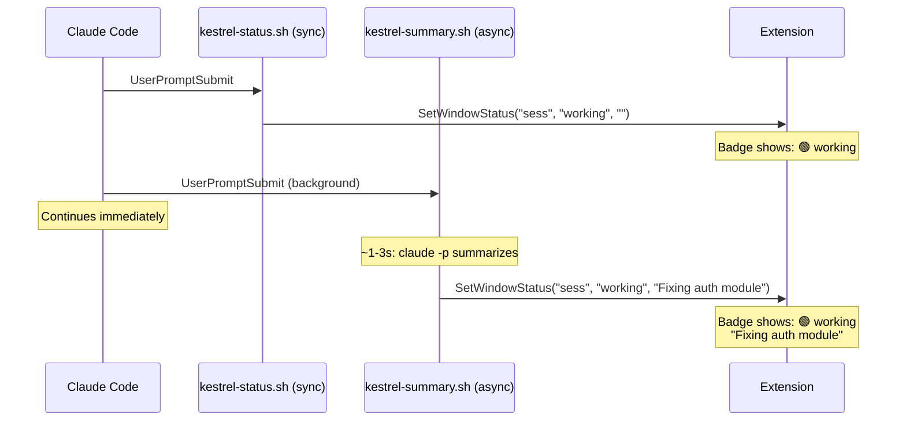
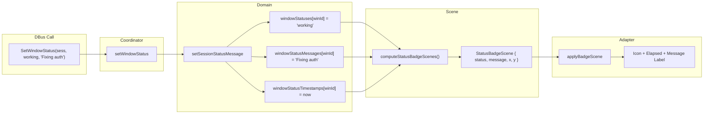

# Status Message on Badge — Design Document

**Issues:** #4 (Task summary on status badge), #5 (Completion summary on done)

## Problem

The status badge on clone windows shows *that* an agent is working or done, but never *what* it's working on or *what* it accomplished. After any context switch — a meeting, a coffee, switching between projects — users must open the terminal and read agent output to reconstruct context. This reconstruction tax is the most frequently cited friction point.

**Goal:** Show a short text summary (2–4 words) alongside the status badge, answering:
- **Working:** "What did I ask it to do?" → task summary from user prompt
- **Done:** "What did it accomplish?" → completion summary from agent's last message

## Architecture Overview



## Key Design Decision: Summarization Strategy

The original plan proposed **agent hooks** (`type: "agent"`) with Haiku for summarization. After investigating the Claude Code hooks API, this approach has a fundamental limitation:

| Hook type | Can summarize? | Can call DBus? | Uses subscription? |
|-----------|---------------|----------------|-------------------|
| `type: "agent"` | Yes (has LLM) | **No** (read-only tools: Read, Grep, Glob) | Yes |
| `type: "prompt"` | Yes (has LLM) | **No** (returns `{ok, reason}` only) | Yes |
| `type: "command"` | No (shell script) | **Yes** (can run gdbus) | N/A |
| `type: "command"` calling `claude -p` | Yes (via CLI) | **Yes** (same script) | Yes |

**Agent and prompt hooks cannot produce side effects.** They only return decisions (`ok`/`reason`). They have no mechanism to call `gdbus` or any external command.

### Chosen approach: Command hook + `claude -p --model haiku`

A command hook with `async: true` that:
1. Extracts the relevant text from stdin JSON (`prompt` or `last_assistant_message`)
2. Calls `claude -p --model haiku` to summarize (uses subscription quota, not API credits)
3. Sends the summary to Kestrel via `gdbus call SetWindowStatus`

This is the only approach that combines subscription-based AI summarization with DBus side effects.



### Hook recursion prevention

The inner `claude -p` call would itself trigger hooks (SessionStart, Stop, etc.), causing infinite recursion. Mitigation: set an environment variable in the hook script and check for it:

```bash
export KESTREL_SUMMARIZING=1
claude -p --model haiku "..."
```

Then in `hooks.json`, all hooks check `$KESTREL_SUMMARIZING` at the top and exit early. Alternatively, the inner `claude` call may use `--no-input` or a settings override that disables hooks.

## Component Changes

### 1. Domain: NotificationState

**File:** `src/domain/notification.ts`

Add a status message map alongside the existing status maps:



New domain function:

```typescript
/** Update status and optional message for a session's window. */
export function setSessionStatusMessage(
    state: NotificationState,
    sessionId: string,
    status: ClaudeStatus,
    message: string,
): NotificationState
```

When `message` is empty, the existing message is preserved (status-only update from `kestrel-status.sh` doesn't clear the message). When `message` is non-empty, it replaces the stored message.

### 2. Domain: StatusBadgeScene

**File:** `src/domain/notification-scene.ts`

Extend the scene model to include the message:

```typescript
export interface StatusBadgeScene {
    readonly windowId: WindowId;
    readonly status: ClaudeStatus;
    readonly x: number;
    readonly y: number;
    readonly size: number;
    readonly visible: boolean;
    readonly message: string;       // ← NEW
}
```

`computeStatusBadgeScenes()` reads from `windowStatusMessages` and includes the message in each badge scene.

### 3. DBus Interface

**File:** `src/adapters/dbus-service.ts`

Extend `SetWindowStatus` with an optional third parameter:

```xml
<method name="SetWindowStatus">
    <arg name="sessionId" direction="in" type="s"/>
    <arg name="status"    direction="in" type="s"/>
    <arg name="message"   direction="in" type="s"/>   <!-- NEW -->
</method>
```

The `message` parameter is always present in the XML schema but callers may pass `""` for status-only updates. Existing `kestrel-status.sh` calls are updated to pass `""` as the third argument.

### 4. NotificationCoordinator

**File:** `src/adapters/notification-coordinator.ts`

Update `setWindowStatus(sessionId, status, message)` to call the new domain function when message is non-empty.

### 5. Status Overlay Adapter

**File:** `src/adapters/output/status-overlay-adapter.ts`

Add a message label (`St.Label`) per window, positioned below the status icon + elapsed time:



Layout: message label positioned below the elapsed time label, left-aligned with the icon, max width constrained to the clone width.

### 6. Status Badge Builders

**File:** `src/ui-components/status-badge-builders.ts`

New builder function:

```typescript
/** Create a message label for display below the status badge. */
export function buildMessageLabel(color: string): St.Label
```

Styling: smaller font than elapsed time (~14px), same status color, ellipsize with `Pango.EllipsizeMode.END`.

### 7. Hook Script

**New file:** `kestrel-plugin/hooks/kestrel-summary.sh`

```bash
#!/bin/bash
# Async hook: summarizes prompt/completion text and sends to Kestrel
# Runs in background — does not block Claude Code

# Prevent recursion from inner claude -p call
[ "$KESTREL_SUMMARIZING" = "1" ] && exit 0

INPUT=$(cat)
SESSION_ID=$(echo "$INPUT" | jq -r '.session_id')
EVENT=$(echo "$INPUT" | jq -r '.hook_event_name')

case "$EVENT" in
    UserPromptSubmit)
        TEXT=$(echo "$INPUT" | jq -r '.prompt')
        STATUS="working"
        PROMPT="Summarize this task request in 2-4 words: $TEXT"
        ;;
    Stop)
        TEXT=$(echo "$INPUT" | jq -r '.last_assistant_message')
        STATUS="done"
        PROMPT="Summarize the outcome in 2-4 words: $TEXT"
        ;;
    *) exit 0 ;;
esac

export KESTREL_SUMMARIZING=1
SUMMARY=$(echo "$PROMPT" | claude -p --model haiku 2>/dev/null)

gdbus call --session --dest org.gnome.Shell \
    --object-path /io/kestrel/Extension \
    --method io.kestrel.Extension.SetWindowStatus \
    "$SESSION_ID" "$STATUS" "$SUMMARY"
```

### 8. Hook Configuration

**File:** `kestrel-plugin/hooks/hooks.json`

Add async summary hooks alongside existing status hooks:

```json
"UserPromptSubmit": [
    {
        "hooks": [
            {
                "type": "command",
                "command": "${CLAUDE_PLUGIN_ROOT}/hooks/kestrel-status.sh working",
                "timeout": 5
            },
            {
                "type": "command",
                "command": "${CLAUDE_PLUGIN_ROOT}/hooks/kestrel-summary.sh",
                "async": true,
                "timeout": 30
            }
        ]
    }
],
"Stop": [
    {
        "hooks": [
            {
                "type": "command",
                "command": "${CLAUDE_PLUGIN_ROOT}/hooks/kestrel-status.sh done"
            },
            {
                "type": "command",
                "command": "${CLAUDE_PLUGIN_ROOT}/hooks/kestrel-summary.sh",
                "async": true,
                "timeout": 30
            },
            {
                "type": "command",
                "command": "${CLAUDE_PLUGIN_ROOT}/hooks/kestrel-notify.sh \"Agent done\"",
                "timeout": 10
            }
        ]
    }
]
```

## Data Flow

### Timing: Two-Phase Badge Update

The status badge updates happen in two phases because the summary hook is async:



**Phase 1 (instant):** Sync `kestrel-status.sh` updates the status color immediately.
**Phase 2 (~1-3s later):** Async `kestrel-summary.sh` adds the text message.

This means the badge color changes instantly, and the message appears a moment later. This is a good UX — the color gives immediate feedback, the text enriches it.

### State Flow Through Domain



## UI Rendering

### Badge Layout in Overview

```
┌─────────────────────────────────────┐
│                              🟢 2.5m│  ← Status icon + elapsed time (existing)
│                     Fixing auth bug │  ← Message label (NEW)
│                                     │
│           [Clone Window]            │
│                                     │
│                                     │
└─────────────────────────────────────┘
```

The message label:
- Positioned below the elapsed time label
- Right-aligned with the icon (anchored to badge x position)
- Max width: clone width (with ellipsis if longer)
- Font: 14px, bold, same status color
- Visible only when message is non-empty

### Color Mapping

| Status | Color | Icon meaning | Message example |
|--------|-------|-------------|-----------------|
| `working` | Green (#4CAF50) | Processing | "Fixing auth module" |
| `needs-input` | Red (#F44336) | Needs attention | (previous message preserved) |
| `done` | Orange (#FF9800) | Idle | "Auth refactored, tests pass" |

## Files Modified

| File | Change |
|------|--------|
| `src/domain/notification-types.ts` | No change |
| `src/domain/notification.ts` | Add `windowStatusMessages` map, `setSessionStatusMessage()` |
| `src/domain/notification-scene.ts` | Add `message` to `StatusBadgeScene`, read from state in `computeStatusBadgeScenes()` |
| `src/adapters/dbus-service.ts` | Add `message` arg to `SetWindowStatus` |
| `src/adapters/notification-coordinator.ts` | Update `setWindowStatus()` to accept and forward message |
| `src/adapters/output/status-overlay-adapter.ts` | Add message label creation, positioning, lifecycle |
| `src/ui-components/status-badge-builders.ts` | Add `buildMessageLabel()` |
| `kestrel-plugin/hooks/kestrel-summary.sh` | **New file** — async summary hook |
| `kestrel-plugin/hooks/kestrel-status.sh` | Add empty third arg to gdbus call |
| `kestrel-plugin/hooks/hooks.json` | Add async summary hooks to UserPromptSubmit and Stop |
| `test/domain/notification.test.ts` | Tests for `setSessionStatusMessage()`, message preservation |
| `test/domain/notification-scene.test.ts` | Tests for message in `StatusBadgeScene` |
| `docs/claude-code-plugin.md` | Document new DBus parameter and summary hook |

## Open Questions

1. **Hook recursion:** The inner `claude -p` call from `kestrel-summary.sh` will trigger its own hooks (SessionStart, Stop, etc.). The `KESTREL_SUMMARIZING=1` environment variable guard prevents recursion, but only if all hook scripts check for it. Need to verify `claude -p` inherits the parent's environment.

2. **Latency of `claude -p`:** Starting a Claude Code CLI subprocess involves initialization overhead beyond the Haiku inference time. Need to benchmark whether the total round-trip stays under 5s.

3. **Fallback:** If `claude -p` fails (no internet, rate limit, etc.), the summary hook should fail silently. The badge still shows the correct status from the sync hook — just without a message.
